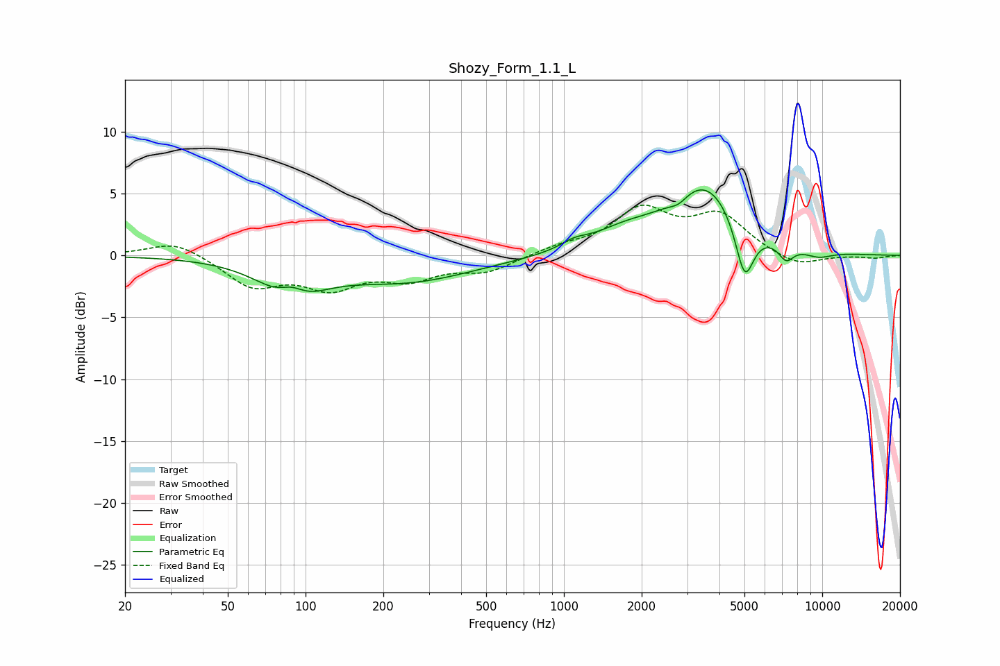

# Shozy_Form_1.1_L
See [usage instructions](https://github.com/jaakkopasanen/AutoEq#usage) for more options and info.

### Parametric EQs
Apply preamp of -5.4 dB when using parametric equalizer.

|   # | Type    |   Fc (Hz) |    Q |   Gain (dB) |
|-----|---------|-----------|------|-------------|
|   1 | Peaking |        88 | 1.29 |        -3.4 |
|   2 | Peaking |        88 | 2.63 |         1.5 |
|   3 | Peaking |       247 | 0.55 |        -2   |
|   4 | Peaking |      1095 | 2.7  |         0.6 |
|   5 | Peaking |      1711 | 1.11 |         1.4 |
|   6 | Peaking |      2777 | 4.08 |        -0.6 |
|   7 | Peaking |      3532 | 1.02 |         5.6 |
|   8 | Peaking |      5008 | 3.83 |        -4.8 |
|   9 | Peaking |      7249 | 4.52 |        -1.3 |
|  10 | Peaking |      9640 | 2.24 |        -0.6 |

### Fixed Band EQs
When using fixed band (also called graphic) equalizer, apply preamp of **-4.2 dB** (if available) and set gains manually with these parameters.

|   # | Type    |   Fc (Hz) |    Q |   Gain (dB) |
|-----|---------|-----------|------|-------------|
|   1 | Peaking |        31 | 1.41 |         1.2 |
|   2 | Peaking |        62 | 1.41 |        -2.4 |
|   3 | Peaking |       125 | 1.41 |        -2.3 |
|   4 | Peaking |       250 | 1.41 |        -1.6 |
|   5 | Peaking |       500 | 1.41 |        -1.2 |
|   6 | Peaking |      1000 | 1.41 |         0.6 |
|   7 | Peaking |      2000 | 1.41 |         3.5 |
|   8 | Peaking |      4000 | 1.41 |         3.1 |
|   9 | Peaking |      8000 | 1.41 |        -1   |
|  10 | Peaking |     16000 | 1.41 |        -0.2 |

### Graphs

