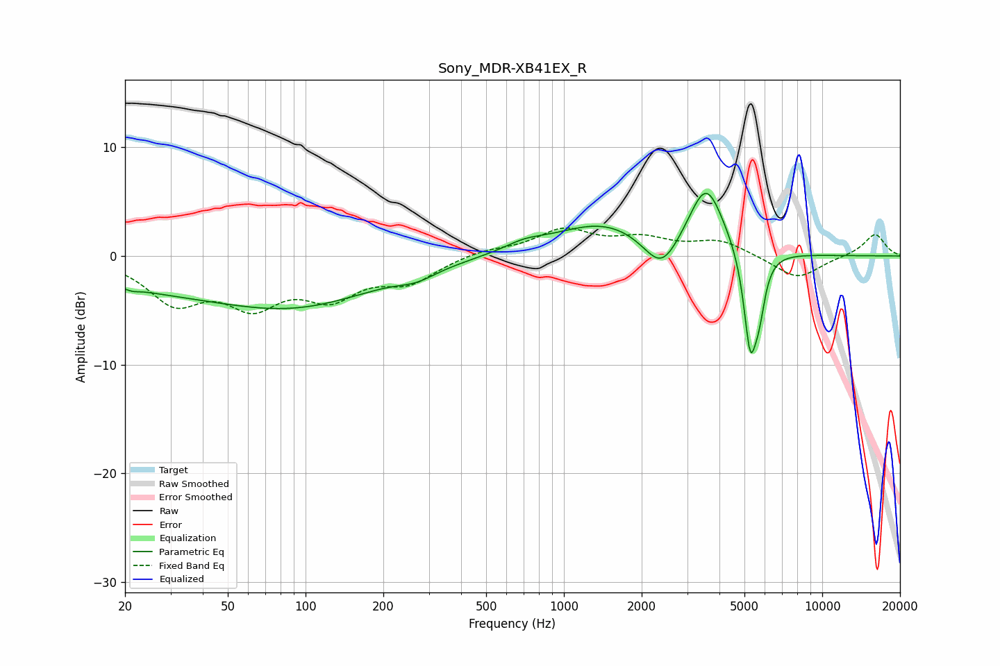

# Sony_MDR-XB41EX_R
See [usage instructions](https://github.com/jaakkopasanen/AutoEq#usage) for more options and info.

### Parametric EQs
Apply preamp of -5.9 dB when using parametric equalizer.

|   # | Type    |   Fc (Hz) |    Q |   Gain (dB) |
|-----|---------|-----------|------|-------------|
|   1 | Peaking |        21 | 5.27 |        -0.2 |
|   2 | Peaking |        24 | 0.45 |        -2.1 |
|   3 | Peaking |        93 | 0.45 |        -4.2 |
|   4 | Peaking |       269 | 1.95 |        -0.8 |
|   5 | Peaking |       701 | 1.8  |         0.7 |
|   6 | Peaking |      1418 | 0.73 |         3   |
|   7 | Peaking |      2388 | 2.05 |        -3.5 |
|   8 | Peaking |      3554 | 2.06 |         6.3 |
|   9 | Peaking |      5263 | 5.4  |        -8.9 |
|  10 | Peaking |      5699 | 6    |        -3.5 |

### Fixed Band EQs
When using fixed band (also called graphic) equalizer, apply preamp of **-2.7 dB** (if available) and set gains manually with these parameters.

|   # | Type    |   Fc (Hz) |    Q |   Gain (dB) |
|-----|---------|-----------|------|-------------|
|   1 | Peaking |        31 | 1.41 |        -3.9 |
|   2 | Peaking |        62 | 1.41 |        -3.9 |
|   3 | Peaking |       125 | 1.41 |        -3.3 |
|   4 | Peaking |       250 | 1.41 |        -2.2 |
|   5 | Peaking |       500 | 1.41 |         0.6 |
|   6 | Peaking |      1000 | 1.41 |         2.3 |
|   7 | Peaking |      2000 | 1.41 |         1.4 |
|   8 | Peaking |      4000 | 1.41 |         1.4 |
|   9 | Peaking |      8000 | 1.41 |        -2.1 |
|  10 | Peaking |     16000 | 1.41 |         2.1 |

### Graphs

