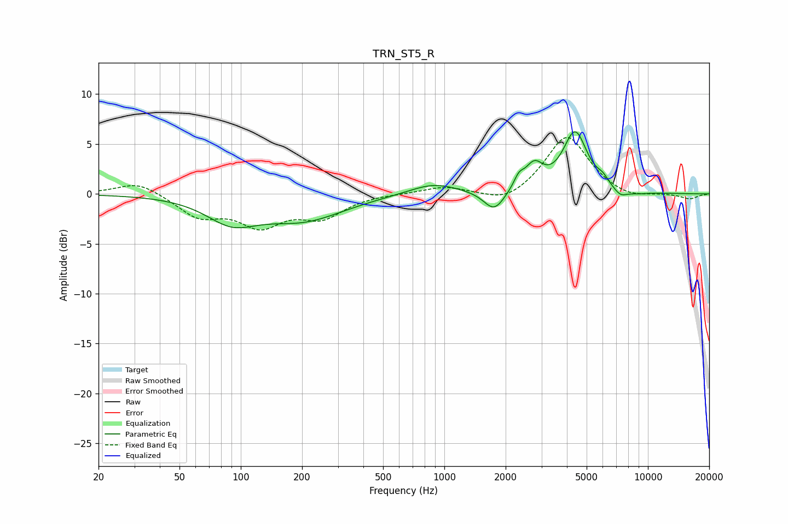

# TRN_ST5_R
See [usage instructions](https://github.com/jaakkopasanen/AutoEq#usage) for more options and info.

### Parametric EQs
Apply preamp of -6.3 dB when using parametric equalizer.

|   # | Type    |   Fc (Hz) |    Q |   Gain (dB) |
|-----|---------|-----------|------|-------------|
|   1 | Peaking |        90 | 1.14 |        -2.4 |
|   2 | Peaking |       203 | 0.71 |        -2.4 |
|   3 | Peaking |       884 | 1.16 |         1.1 |
|   4 | Peaking |      1758 | 2.77 |        -2.1 |
|   5 | Peaking |      2322 | 5.69 |         1.1 |
|   6 | Peaking |      2758 | 3.19 |         2.4 |
|   7 | Peaking |      4389 | 2.35 |         6   |
|   8 | Peaking |      6007 | 4.81 |         0.7 |
|   9 | Peaking |      7322 | 3.83 |        -0.8 |
|  10 | Peaking |      8860 | 2.44 |        -0.2 |

### Fixed Band EQs
When using fixed band (also called graphic) equalizer, apply preamp of **-5.7 dB** (if available) and set gains manually with these parameters.

|   # | Type    |   Fc (Hz) |    Q |   Gain (dB) |
|-----|---------|-----------|------|-------------|
|   1 | Peaking |        31 | 1.41 |         1.3 |
|   2 | Peaking |        62 | 1.41 |        -2.1 |
|   3 | Peaking |       125 | 1.41 |        -2.9 |
|   4 | Peaking |       250 | 1.41 |        -2.1 |
|   5 | Peaking |       500 | 1.41 |         0   |
|   6 | Peaking |      1000 | 1.41 |         0.7 |
|   7 | Peaking |      2000 | 1.41 |        -1.1 |
|   8 | Peaking |      4000 | 1.41 |         5.9 |
|   9 | Peaking |      8000 | 1.41 |        -0.6 |
|  10 | Peaking |     16000 | 1.41 |        -0.5 |

### Graphs

