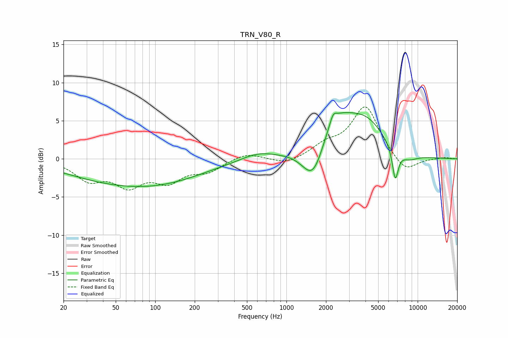

# TRN_V80_R
See [usage instructions](https://github.com/jaakkopasanen/AutoEq#usage) for more options and info.

### Parametric EQs
Apply preamp of -6.2 dB when using parametric equalizer.

|   # | Type    |   Fc (Hz) |    Q |   Gain (dB) |
|-----|---------|-----------|------|-------------|
|   1 | Peaking |        57 | 0.34 |        -3.1 |
|   2 | Peaking |       155 | 0.46 |        -1   |
|   3 | Peaking |       603 | 1.09 |         0.9 |
|   4 | Peaking |      1606 | 1.64 |        -5.2 |
|   5 | Peaking |      1634 | 1.47 |        -0.6 |
|   6 | Peaking |      2268 | 5.65 |         1.2 |
|   7 | Peaking |      2334 | 0.9  |         5.9 |
|   8 | Peaking |      4159 | 1.02 |         3.4 |
|   9 | Peaking |      6749 | 5.83 |        -4.3 |
|  10 | Peaking |      8485 | 1.85 |        -1   |

### Fixed Band EQs
When using fixed band (also called graphic) equalizer, apply preamp of **-6.9 dB** (if available) and set gains manually with these parameters.

|   # | Type    |   Fc (Hz) |    Q |   Gain (dB) |
|-----|---------|-----------|------|-------------|
|   1 | Peaking |        31 | 1.41 |        -2.5 |
|   2 | Peaking |        62 | 1.41 |        -3.1 |
|   3 | Peaking |       125 | 1.41 |        -2.6 |
|   4 | Peaking |       250 | 1.41 |        -1.5 |
|   5 | Peaking |       500 | 1.41 |         0.9 |
|   6 | Peaking |      1000 | 1.41 |        -0.8 |
|   7 | Peaking |      2000 | 1.41 |         1.5 |
|   8 | Peaking |      4000 | 1.41 |         6.9 |
|   9 | Peaking |      8000 | 1.41 |        -2   |
|  10 | Peaking |     16000 | 1.41 |         0.2 |

### Graphs

