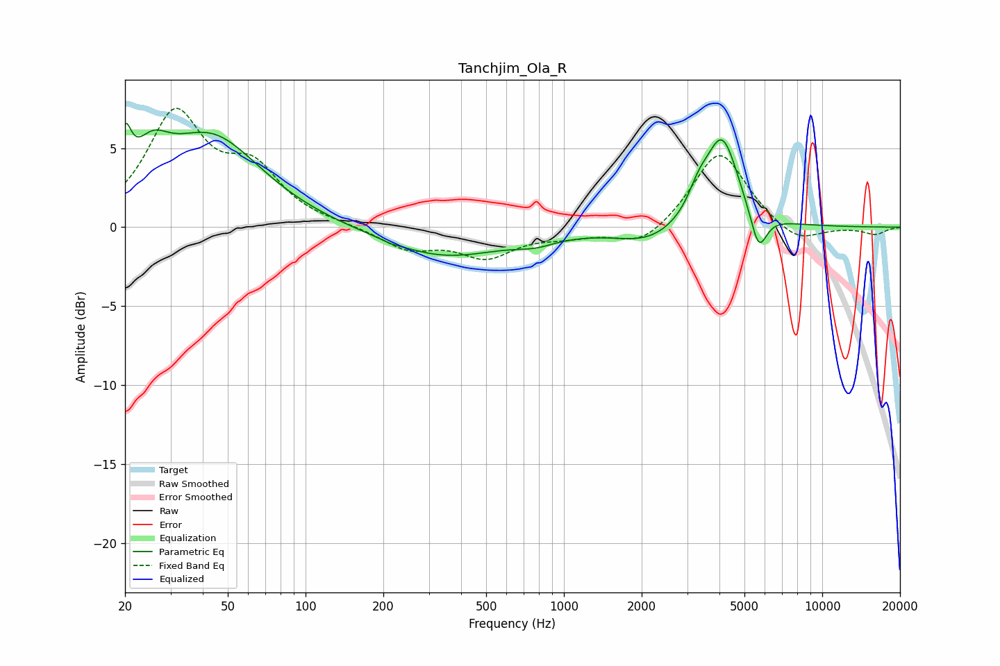

# Tanchjim_Ola_R
See [usage instructions](https://github.com/jaakkopasanen/AutoEq#usage) for more options and info.

### Parametric EQs
Apply preamp of -6.7 dB when using parametric equalizer.

|   # | Type    |   Fc (Hz) |    Q |   Gain (dB) |
|-----|---------|-----------|------|-------------|
|   1 | Peaking |        20 | 6    |         3.1 |
|   2 | Peaking |        25 | 2.11 |         2.4 |
|   3 | Peaking |        43 | 0.73 |         5.6 |
|   4 | Peaking |       215 | 5.99 |        -0.1 |
|   5 | Peaking |       341 | 0.62 |        -1.9 |
|   6 | Peaking |       777 | 1.77 |        -0.5 |
|   7 | Peaking |      2142 | 1.12 |        -1   |
|   8 | Peaking |      3323 | 3.48 |         1.3 |
|   9 | Peaking |      4095 | 2.18 |         5.7 |
|  10 | Peaking |      5673 | 4.36 |        -2.5 |

### Fixed Band EQs
When using fixed band (also called graphic) equalizer, apply preamp of **-7.6 dB** (if available) and set gains manually with these parameters.

|   # | Type    |   Fc (Hz) |    Q |   Gain (dB) |
|-----|---------|-----------|------|-------------|
|   1 | Peaking |        31 | 1.41 |         6.9 |
|   2 | Peaking |        62 | 1.41 |         3.2 |
|   3 | Peaking |       125 | 1.41 |         0.1 |
|   4 | Peaking |       250 | 1.41 |        -1.3 |
|   5 | Peaking |       500 | 1.41 |        -1.8 |
|   6 | Peaking |      1000 | 1.41 |        -0.4 |
|   7 | Peaking |      2000 | 1.41 |        -1.3 |
|   8 | Peaking |      4000 | 1.41 |         4.9 |
|   9 | Peaking |      8000 | 1.41 |        -1.1 |
|  10 | Peaking |     16000 | 1.41 |        -0.5 |

### Graphs

