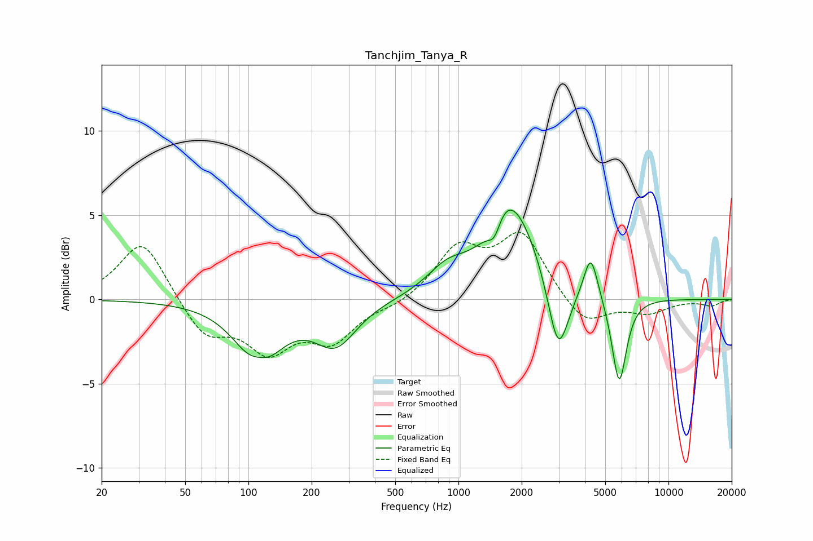

# Tanchjim_Tanya_R
See [usage instructions](https://github.com/jaakkopasanen/AutoEq#usage) for more options and info.

### Parametric EQs
Apply preamp of -5.4 dB when using parametric equalizer.

|   # | Type    |   Fc (Hz) |    Q |   Gain (dB) |
|-----|---------|-----------|------|-------------|
|   1 | Peaking |       112 | 1.4  |        -4.1 |
|   2 | Peaking |       112 | 2.62 |         1   |
|   3 | Peaking |       260 | 1.4  |        -2.5 |
|   4 | Peaking |       880 | 1.48 |         1.3 |
|   5 | Peaking |      1483 | 4.79 |        -1.1 |
|   6 | Peaking |      1656 | 2.83 |         0.6 |
|   7 | Peaking |      1823 | 1.14 |         5.3 |
|   8 | Peaking |      2986 | 2.85 |        -4.7 |
|   9 | Peaking |      4266 | 4.2  |         2.7 |
|  10 | Peaking |      5824 | 3.98 |        -5.2 |

### Fixed Band EQs
When using fixed band (also called graphic) equalizer, apply preamp of **-4.1 dB** (if available) and set gains manually with these parameters.

|   # | Type    |   Fc (Hz) |    Q |   Gain (dB) |
|-----|---------|-----------|------|-------------|
|   1 | Peaking |        31 | 1.41 |         3.6 |
|   2 | Peaking |        62 | 1.41 |        -2.2 |
|   3 | Peaking |       125 | 1.41 |        -2.8 |
|   4 | Peaking |       250 | 1.41 |        -2.3 |
|   5 | Peaking |       500 | 1.41 |        -0.4 |
|   6 | Peaking |      1000 | 1.41 |         2.9 |
|   7 | Peaking |      2000 | 1.41 |         3.8 |
|   8 | Peaking |      4000 | 1.41 |        -1.7 |
|   9 | Peaking |      8000 | 1.41 |        -0.8 |
|  10 | Peaking |     16000 | 1.41 |        -0.4 |

### Graphs

