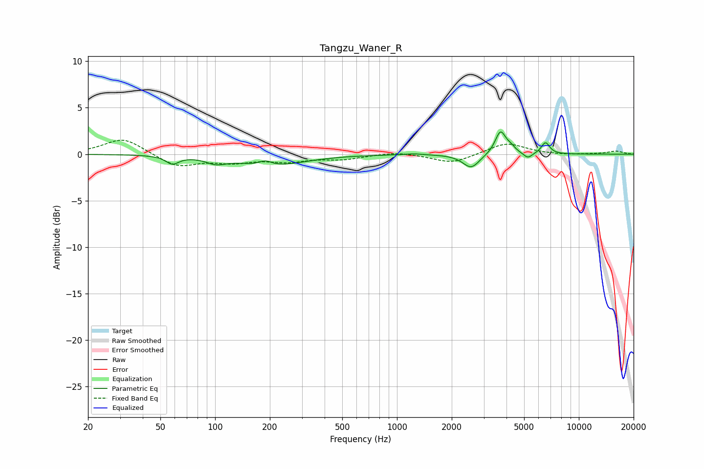

# Tangzu_Waner_R
See [usage instructions](https://github.com/jaakkopasanen/AutoEq#usage) for more options and info.

### Parametric EQs
Apply preamp of -2.5 dB when using parametric equalizer.

|   # | Type    |   Fc (Hz) |    Q |   Gain (dB) |
|-----|---------|-----------|------|-------------|
|   1 | Peaking |        58 | 4.05 |        -0.9 |
|   2 | Peaking |       101 | 2.71 |        -0.6 |
|   3 | Peaking |       189 | 4.06 |         0.5 |
|   4 | Peaking |       203 | 0.8  |        -1.2 |
|   5 | Peaking |      1237 | 3.01 |         0.1 |
|   6 | Peaking |      2557 | 3.09 |        -1.5 |
|   7 | Peaking |      3710 | 4.78 |         2.5 |
|   8 | Peaking |      4238 | 6    |         0.5 |
|   9 | Peaking |      5245 | 5.89 |        -0.6 |
|  10 | Peaking |      6553 | 6    |         1.3 |

### Fixed Band EQs
When using fixed band (also called graphic) equalizer, apply preamp of **-1.6 dB** (if available) and set gains manually with these parameters.

|   # | Type    |   Fc (Hz) |    Q |   Gain (dB) |
|-----|---------|-----------|------|-------------|
|   1 | Peaking |        31 | 1.41 |         1.8 |
|   2 | Peaking |        62 | 1.41 |        -1.4 |
|   3 | Peaking |       125 | 1.41 |        -0.7 |
|   4 | Peaking |       250 | 1.41 |        -0.7 |
|   5 | Peaking |       500 | 1.41 |        -0.5 |
|   6 | Peaking |      1000 | 1.41 |         0.3 |
|   7 | Peaking |      2000 | 1.41 |        -1   |
|   8 | Peaking |      4000 | 1.41 |         1.2 |
|   9 | Peaking |      8000 | 1.41 |        -0.1 |
|  10 | Peaking |     16000 | 1.41 |         0.3 |

### Graphs

