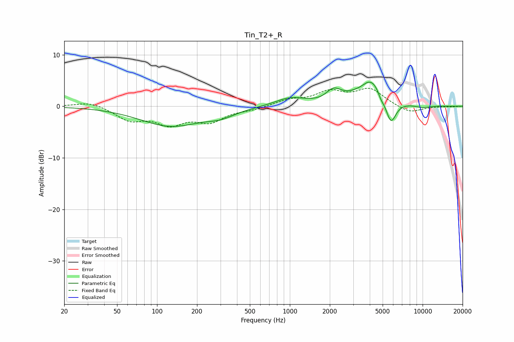

# Tin_T2+_R
See [usage instructions](https://github.com/jaakkopasanen/AutoEq#usage) for more options and info.

### Parametric EQs
Apply preamp of -4.8 dB when using parametric equalizer.

|   # | Type    |   Fc (Hz) |    Q |   Gain (dB) |
|-----|---------|-----------|------|-------------|
|   1 | Peaking |       126 | 0.62 |        -3.8 |
|   2 | Peaking |       301 | 1.31 |        -1.2 |
|   3 | Peaking |      1008 | 1.22 |         1.6 |
|   4 | Peaking |      2090 | 2.87 |         1.6 |
|   5 | Peaking |      2298 | 2.6  |         0.7 |
|   6 | Peaking |      3521 | 2.85 |        -0.6 |
|   7 | Peaking |      4067 | 1.39 |         5.6 |
|   8 | Peaking |      4859 | 6    |        -1.1 |
|   9 | Peaking |      5759 | 3.39 |        -5.1 |
|  10 | Peaking |      9957 | 2.04 |        -0.5 |

### Fixed Band EQs
When using fixed band (also called graphic) equalizer, apply preamp of **-3.6 dB** (if available) and set gains manually with these parameters.

|   # | Type    |   Fc (Hz) |    Q |   Gain (dB) |
|-----|---------|-----------|------|-------------|
|   1 | Peaking |        31 | 1.41 |         1   |
|   2 | Peaking |        62 | 1.41 |        -2.5 |
|   3 | Peaking |       125 | 1.41 |        -3.1 |
|   4 | Peaking |       250 | 1.41 |        -2.7 |
|   5 | Peaking |       500 | 1.41 |        -0.5 |
|   6 | Peaking |      1000 | 1.41 |         1.1 |
|   7 | Peaking |      2000 | 1.41 |         2.6 |
|   8 | Peaking |      4000 | 1.41 |         3.2 |
|   9 | Peaking |      8000 | 1.41 |        -1.4 |
|  10 | Peaking |     16000 | 1.41 |        -0.1 |

### Graphs

