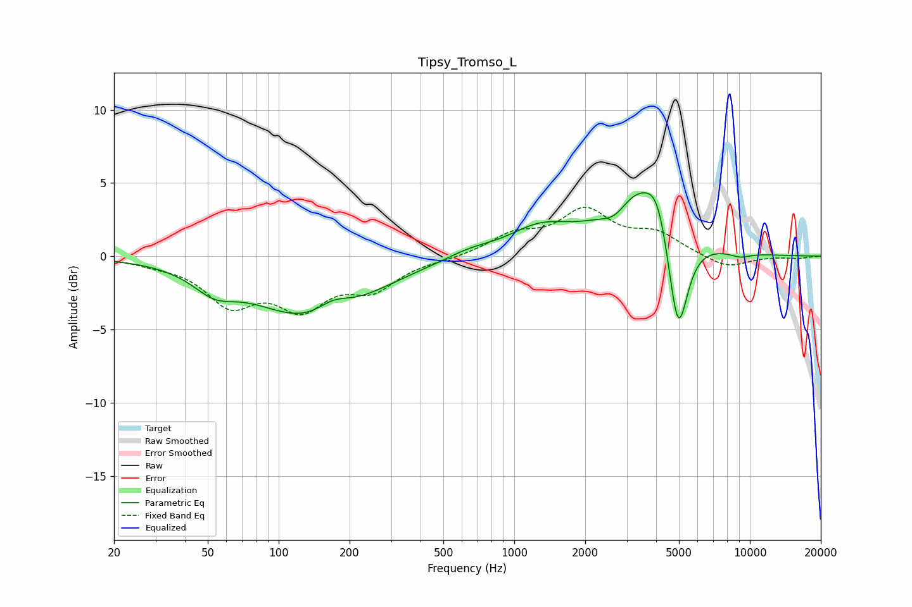

# Tipsy_Tromso_L
See [usage instructions](https://github.com/jaakkopasanen/AutoEq#usage) for more options and info.

### Parametric EQs
Apply preamp of -4.4 dB when using parametric equalizer.

|   # | Type    |   Fc (Hz) |    Q |   Gain (dB) |
|-----|---------|-----------|------|-------------|
|   1 | Peaking |        53 | 1.58 |        -1.4 |
|   2 | Peaking |       140 | 0.57 |        -4.3 |
|   3 | Peaking |       170 | 1.93 |         1.1 |
|   4 | Peaking |       646 | 1.38 |         0.5 |
|   5 | Peaking |      1282 | 1.06 |         1.7 |
|   6 | Peaking |      2684 | 2.35 |        -1.3 |
|   7 | Peaking |      3340 | 1.03 |         4.8 |
|   8 | Peaking |      4053 | 3.11 |         2   |
|   9 | Peaking |      4955 | 3.26 |        -7.5 |
|  10 | Peaking |      9095 | 2.82 |        -0.3 |

### Fixed Band EQs
When using fixed band (also called graphic) equalizer, apply preamp of **-3.4 dB** (if available) and set gains manually with these parameters.

|   # | Type    |   Fc (Hz) |    Q |   Gain (dB) |
|-----|---------|-----------|------|-------------|
|   1 | Peaking |        31 | 1.41 |        -0.3 |
|   2 | Peaking |        62 | 1.41 |        -3   |
|   3 | Peaking |       125 | 1.41 |        -3.1 |
|   4 | Peaking |       250 | 1.41 |        -2   |
|   5 | Peaking |       500 | 1.41 |        -0.2 |
|   6 | Peaking |      1000 | 1.41 |         1.3 |
|   7 | Peaking |      2000 | 1.41 |         2.9 |
|   8 | Peaking |      4000 | 1.41 |         1.4 |
|   9 | Peaking |      8000 | 1.41 |        -0.9 |
|  10 | Peaking |     16000 | 1.41 |        -0.1 |

### Graphs

