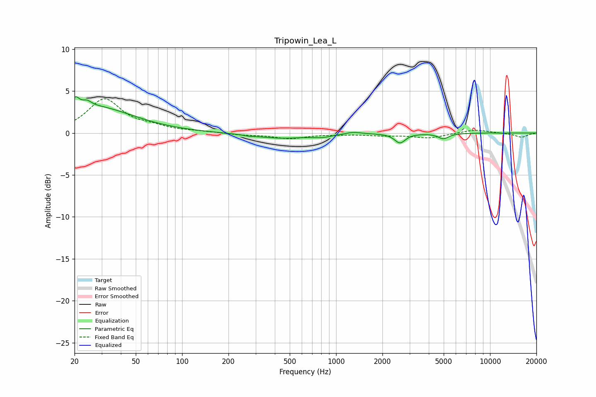

# Tripowin_Lea_L
See [usage instructions](https://github.com/jaakkopasanen/AutoEq#usage) for more options and info.

### Parametric EQs
Apply preamp of -4.4 dB when using parametric equalizer.

|   # | Type    |   Fc (Hz) |    Q |   Gain (dB) |
|-----|---------|-----------|------|-------------|
|   1 | Peaking |        20 | 5.71 |         1.3 |
|   2 | Peaking |        24 | 4.87 |         0.6 |
|   3 | Peaking |        26 | 0.55 |         3.1 |
|   4 | Peaking |       273 | 5.04 |        -0.1 |
|   5 | Peaking |       439 | 0.79 |        -0.6 |
|   6 | Peaking |       817 | 2.4  |        -0.3 |
|   7 | Peaking |      1288 | 2.93 |         0.3 |
|   8 | Peaking |      2600 | 4.11 |        -1.1 |
|   9 | Peaking |      4979 | 4.1  |        -0.6 |
|  10 | Peaking |      9939 | 6    |         0   |

### Fixed Band EQs
When using fixed band (also called graphic) equalizer, apply preamp of **-4.2 dB** (if available) and set gains manually with these parameters.

|   # | Type    |   Fc (Hz) |    Q |   Gain (dB) |
|-----|---------|-----------|------|-------------|
|   1 | Peaking |        31 | 1.41 |         4   |
|   2 | Peaking |        62 | 1.41 |         0.6 |
|   3 | Peaking |       125 | 1.41 |         0.1 |
|   4 | Peaking |       250 | 1.41 |        -0.2 |
|   5 | Peaking |       500 | 1.41 |        -0.6 |
|   6 | Peaking |      1000 | 1.41 |        -0.1 |
|   7 | Peaking |      2000 | 1.41 |        -0.2 |
|   8 | Peaking |      4000 | 1.41 |        -0.6 |
|   9 | Peaking |      8000 | 1.41 |         0.4 |
|  10 | Peaking |     16000 | 1.41 |        -0.5 |

### Graphs

