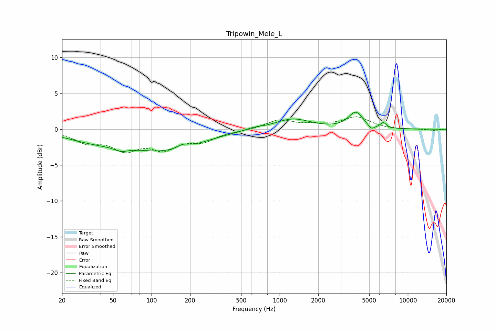

# Tripowin_Mele_L
See [usage instructions](https://github.com/jaakkopasanen/AutoEq#usage) for more options and info.

### Parametric EQs
Apply preamp of -2.5 dB when using parametric equalizer.

|   # | Type    |   Fc (Hz) |    Q |   Gain (dB) |
|-----|---------|-----------|------|-------------|
|   1 | Peaking |        35 | 0.65 |        -1.3 |
|   2 | Peaking |        58 | 2.68 |        -0.6 |
|   3 | Peaking |       127 | 0.5  |        -2.8 |
|   4 | Peaking |       176 | 3.21 |         0.5 |
|   5 | Peaking |       232 | 1.86 |        -0.1 |
|   6 | Peaking |       628 | 2.29 |         0.3 |
|   7 | Peaking |      1259 | 1.03 |         1.5 |
|   8 | Peaking |      3927 | 2.51 |         2.3 |
|   9 | Peaking |      5182 | 5.41 |        -0.7 |
|  10 | Peaking |      6444 | 6    |         0.7 |

### Fixed Band EQs
When using fixed band (also called graphic) equalizer, apply preamp of **-1.8 dB** (if available) and set gains manually with these parameters.

|   # | Type    |   Fc (Hz) |    Q |   Gain (dB) |
|-----|---------|-----------|------|-------------|
|   1 | Peaking |        31 | 1.41 |        -1.6 |
|   2 | Peaking |        62 | 1.41 |        -2.5 |
|   3 | Peaking |       125 | 1.41 |        -2.4 |
|   4 | Peaking |       250 | 1.41 |        -1.4 |
|   5 | Peaking |       500 | 1.41 |        -0.1 |
|   6 | Peaking |      1000 | 1.41 |         1.3 |
|   7 | Peaking |      2000 | 1.41 |         0.5 |
|   8 | Peaking |      4000 | 1.41 |         1.6 |
|   9 | Peaking |      8000 | 1.41 |        -0.1 |
|  10 | Peaking |     16000 | 1.41 |        -0.2 |

### Graphs

