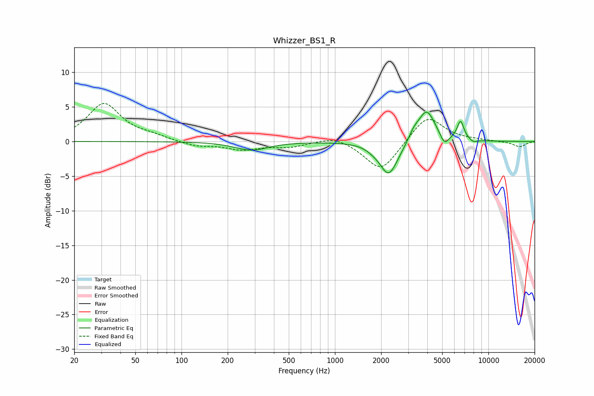

# Whizzer_BS1_R
See [usage instructions](https://github.com/jaakkopasanen/AutoEq#usage) for more options and info.

### Parametric EQs
Apply preamp of -4.3 dB when using parametric equalizer.

|   # | Type    |   Fc (Hz) |    Q |   Gain (dB) |
|-----|---------|-----------|------|-------------|
|   1 | Peaking |       209 | 3.43 |        -0   |
|   2 | Peaking |       287 | 1.34 |        -1.2 |
|   3 | Peaking |      1766 | 3.54 |        -0.3 |
|   4 | Peaking |      2230 | 2.49 |        -4.3 |
|   5 | Peaking |      2473 | 1.88 |        -0.7 |
|   6 | Peaking |      3258 | 4.22 |         1.1 |
|   7 | Peaking |      3955 | 2.53 |         4.6 |
|   8 | Peaking |      5173 | 5.22 |        -1.5 |
|   9 | Peaking |      6582 | 5.98 |         2.7 |
|  10 | Peaking |      7959 | 5.21 |        -0.4 |

### Fixed Band EQs
When using fixed band (also called graphic) equalizer, apply preamp of **-5.6 dB** (if available) and set gains manually with these parameters.

|   # | Type    |   Fc (Hz) |    Q |   Gain (dB) |
|-----|---------|-----------|------|-------------|
|   1 | Peaking |        31 | 1.41 |         5.4 |
|   2 | Peaking |        62 | 1.41 |         0.6 |
|   3 | Peaking |       125 | 1.41 |        -0.7 |
|   4 | Peaking |       250 | 1.41 |        -1.1 |
|   5 | Peaking |       500 | 1.41 |        -0.7 |
|   6 | Peaking |      1000 | 1.41 |         0.9 |
|   7 | Peaking |      2000 | 1.41 |        -4.4 |
|   8 | Peaking |      4000 | 1.41 |         3.9 |
|   9 | Peaking |      8000 | 1.41 |         0.1 |
|  10 | Peaking |     16000 | 1.41 |        -0.8 |

### Graphs

