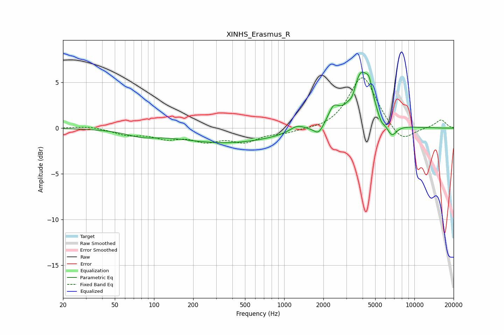

# XINHS_Erasmus_R
See [usage instructions](https://github.com/jaakkopasanen/AutoEq#usage) for more options and info.

### Parametric EQs
Apply preamp of -6.2 dB when using parametric equalizer.

|   # | Type    |   Fc (Hz) |    Q |   Gain (dB) |
|-----|---------|-----------|------|-------------|
|   1 | Peaking |        80 | 1.23 |        -0.6 |
|   2 | Peaking |       364 | 0.36 |        -1.6 |
|   3 | Peaking |      1254 | 2.52 |         0.7 |
|   4 | Peaking |      1838 | 3.93 |        -1   |
|   5 | Peaking |      2391 | 3.5  |         1.7 |
|   6 | Peaking |      3355 | 5.77 |        -0.9 |
|   7 | Peaking |      3886 | 1.97 |         6   |
|   8 | Peaking |      4505 | 6    |         1.5 |
|   9 | Peaking |      5553 | 6    |        -0.7 |
|  10 | Peaking |      6681 | 3.33 |        -1.5 |

### Fixed Band EQs
When using fixed band (also called graphic) equalizer, apply preamp of **-5.6 dB** (if available) and set gains manually with these parameters.

|   # | Type    |   Fc (Hz) |    Q |   Gain (dB) |
|-----|---------|-----------|------|-------------|
|   1 | Peaking |        31 | 1.41 |         0.2 |
|   2 | Peaking |        62 | 1.41 |        -0.7 |
|   3 | Peaking |       125 | 1.41 |        -0.9 |
|   4 | Peaking |       250 | 1.41 |        -1.2 |
|   5 | Peaking |       500 | 1.41 |        -1.3 |
|   6 | Peaking |      1000 | 1.41 |        -0.5 |
|   7 | Peaking |      2000 | 1.41 |        -0.2 |
|   8 | Peaking |      4000 | 1.41 |         5.8 |
|   9 | Peaking |      8000 | 1.41 |        -1.8 |
|  10 | Peaking |     16000 | 1.41 |         0.9 |

### Graphs

