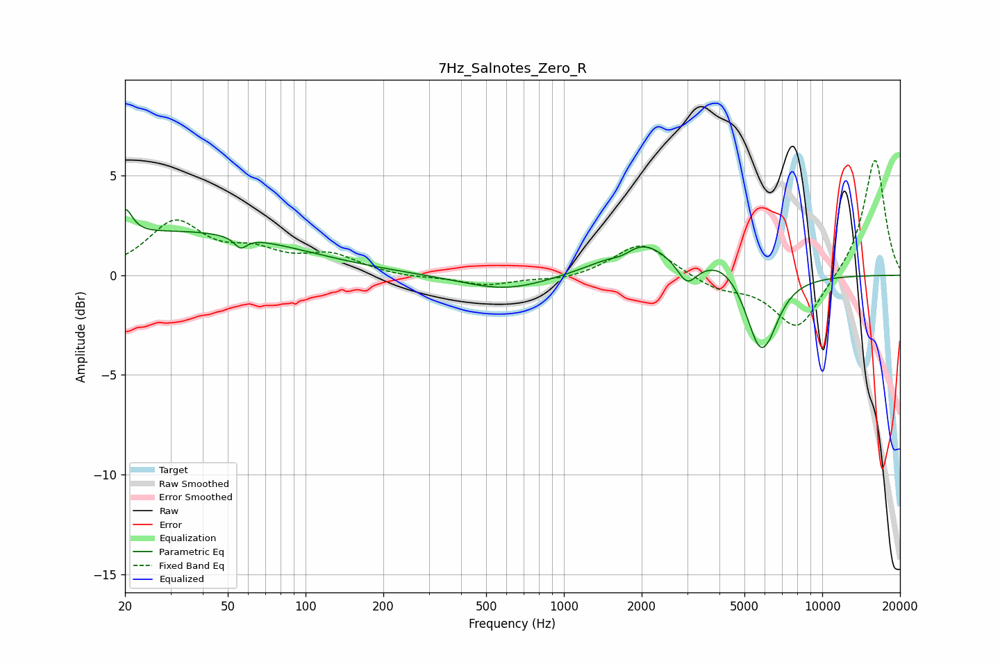

# 7Hz_Salnotes_Zero_R
See [usage instructions](https://github.com/jaakkopasanen/AutoEq#usage) for more options and info.

### Parametric EQs
Apply preamp of -3.4 dB when using parametric equalizer.

|   # | Type    |   Fc (Hz) |    Q |   Gain (dB) |
|-----|---------|-----------|------|-------------|
|   1 | Peaking |        20 | 5.16 |         1.4 |
|   2 | Peaking |        33 | 0.32 |         2.2 |
|   3 | Peaking |        56 | 5.98 |        -0.6 |
|   4 | Peaking |       596 | 0.85 |        -0.8 |
|   5 | Peaking |      1688 | 2.8  |        -0.5 |
|   6 | Peaking |      1928 | 1.19 |         1.9 |
|   7 | Peaking |      2998 | 3.8  |        -1.1 |
|   8 | Peaking |      4127 | 1.7  |         0.8 |
|   9 | Peaking |      5849 | 2.46 |        -4.3 |
|  10 | Peaking |      5950 | 5.11 |         0.3 |

### Fixed Band EQs
When using fixed band (also called graphic) equalizer, apply preamp of **-5.9 dB** (if available) and set gains manually with these parameters.

|   # | Type    |   Fc (Hz) |    Q |   Gain (dB) |
|-----|---------|-----------|------|-------------|
|   1 | Peaking |        31 | 1.41 |         2.6 |
|   2 | Peaking |        62 | 1.41 |         1   |
|   3 | Peaking |       125 | 1.41 |         0.9 |
|   4 | Peaking |       250 | 1.41 |        -0.1 |
|   5 | Peaking |       500 | 1.41 |        -0.5 |
|   6 | Peaking |      1000 | 1.41 |        -0.3 |
|   7 | Peaking |      2000 | 1.41 |         1.7 |
|   8 | Peaking |      4000 | 1.41 |        -0.7 |
|   9 | Peaking |      8000 | 1.41 |        -2.8 |
|  10 | Peaking |     16000 | 1.41 |         5.9 |

### Graphs

