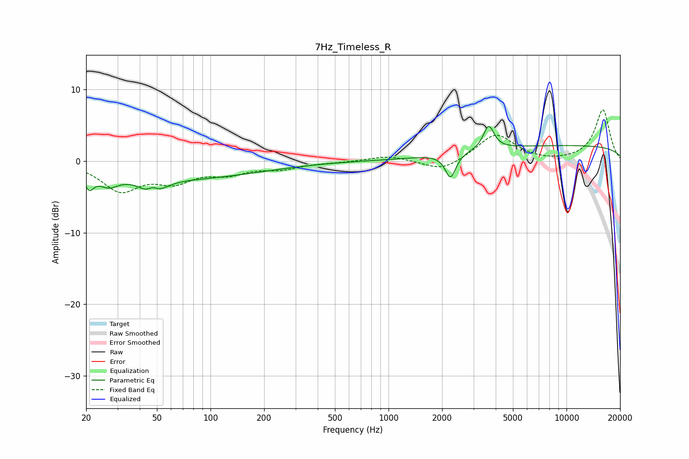

# 7Hz_Timeless_R
See [usage instructions](https://github.com/jaakkopasanen/AutoEq#usage) for more options and info.

### Parametric EQs
Apply preamp of -4.9 dB when using parametric equalizer.

|   # | Type    |   Fc (Hz) |    Q |   Gain (dB) |
|-----|---------|-----------|------|-------------|
|   1 | Peaking |        21 | 5.54 |        -2.2 |
|   2 | Peaking |        27 | 2.43 |        -1.8 |
|   3 | Peaking |        39 | 1.21 |        -0   |
|   4 | Peaking |        47 | 2.5  |        -3.2 |
|   5 | Peaking |        47 | 4.45 |         1.8 |
|   6 | Peaking |        73 | 0.33 |        -2.3 |
|   7 | Peaking |      1117 | 3.05 |        -0   |
|   8 | Peaking |      2231 | 4.81 |        -3.5 |
|   9 | Peaking |      3655 | 4.81 |         3.3 |
|  10 | Peaking |     10000 | 0.18 |         2.1 |

### Fixed Band EQs
When using fixed band (also called graphic) equalizer, apply preamp of **-7.2 dB** (if available) and set gains manually with these parameters.

|   # | Type    |   Fc (Hz) |    Q |   Gain (dB) |
|-----|---------|-----------|------|-------------|
|   1 | Peaking |        31 | 1.41 |        -3.9 |
|   2 | Peaking |        62 | 1.41 |        -2.5 |
|   3 | Peaking |       125 | 1.41 |        -1.5 |
|   4 | Peaking |       250 | 1.41 |        -0.9 |
|   5 | Peaking |       500 | 1.41 |        -0.1 |
|   6 | Peaking |      1000 | 1.41 |         0.8 |
|   7 | Peaking |      2000 | 1.41 |        -1.5 |
|   8 | Peaking |      4000 | 1.41 |         3.8 |
|   9 | Peaking |      8000 | 1.41 |        -0.2 |
|  10 | Peaking |     16000 | 1.41 |         7.2 |

### Graphs

