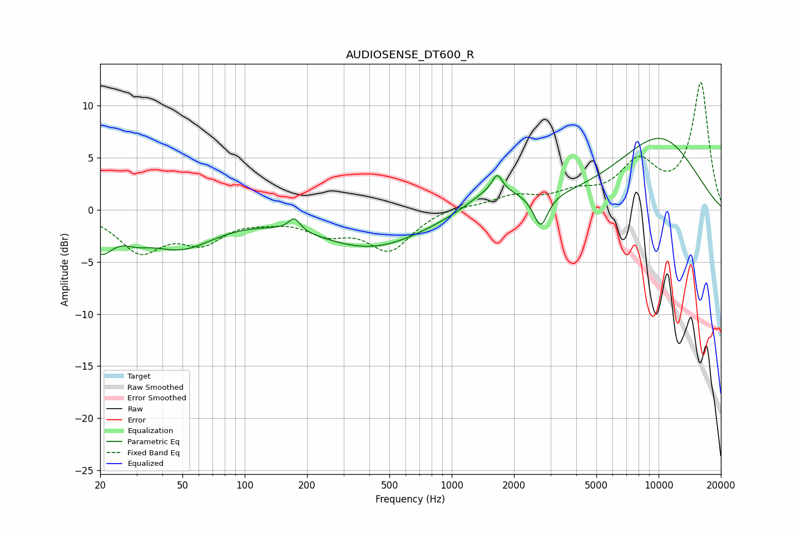

# AUDIOSENSE_DT600_R
See [usage instructions](https://github.com/jaakkopasanen/AutoEq#usage) for more options and info.

### Parametric EQs
Apply preamp of -6.9 dB when using parametric equalizer.

|   # | Type    |   Fc (Hz) |    Q |   Gain (dB) |
|-----|---------|-----------|------|-------------|
|   1 | Peaking |        20 | 2.29 |        -3.1 |
|   2 | Peaking |        30 | 2.21 |        -0.9 |
|   3 | Peaking |        49 | 0.83 |        -3.4 |
|   4 | Peaking |       174 | 5.09 |         1.2 |
|   5 | Peaking |       409 | 0.53 |        -3.6 |
|   6 | Peaking |      1629 | 1.23 |         3.2 |
|   7 | Peaking |      1661 | 5.9  |         1.6 |
|   8 | Peaking |      1697 | 1.56 |        -1.1 |
|   9 | Peaking |      2691 | 4.09 |        -3.1 |
|  10 | Peaking |     10000 | 0.56 |         6.8 |

### Fixed Band EQs
When using fixed band (also called graphic) equalizer, apply preamp of **-12.3 dB** (if available) and set gains manually with these parameters.

|   # | Type    |   Fc (Hz) |    Q |   Gain (dB) |
|-----|---------|-----------|------|-------------|
|   1 | Peaking |        31 | 1.41 |        -3.8 |
|   2 | Peaking |        62 | 1.41 |        -2.7 |
|   3 | Peaking |       125 | 1.41 |        -0.6 |
|   4 | Peaking |       250 | 1.41 |        -1.9 |
|   5 | Peaking |       500 | 1.41 |        -3.7 |
|   6 | Peaking |      1000 | 1.41 |         0.4 |
|   7 | Peaking |      2000 | 1.41 |         1.2 |
|   8 | Peaking |      4000 | 1.41 |         1.3 |
|   9 | Peaking |      8000 | 1.41 |         4.1 |
|  10 | Peaking |     16000 | 1.41 |        12.1 |

### Graphs

