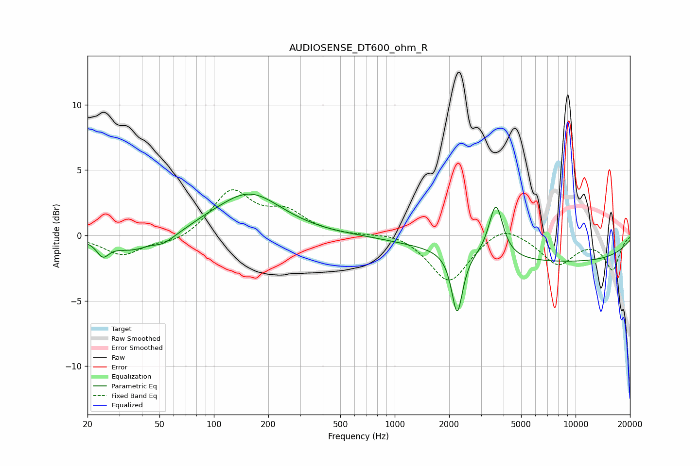

# AUDIOSENSE_DT600_ohm_R
See [usage instructions](https://github.com/jaakkopasanen/AutoEq#usage) for more options and info.

### Parametric EQs
Apply preamp of -3.3 dB when using parametric equalizer.

|   # | Type    |   Fc (Hz) |    Q |   Gain (dB) |
|-----|---------|-----------|------|-------------|
|   1 | Peaking |        24 | 4.41 |        -1   |
|   2 | Peaking |        37 | 1.02 |        -1.3 |
|   3 | Peaking |        45 | 2.1  |         0.4 |
|   4 | Peaking |        52 | 2.22 |        -0.6 |
|   5 | Peaking |        92 | 1.47 |         0.2 |
|   6 | Peaking |       157 | 0.8  |         3.2 |
|   7 | Peaking |      1034 | 2.8  |        -0   |
|   8 | Peaking |      2215 | 4.77 |        -4.7 |
|   9 | Peaking |      3625 | 3.72 |         4.1 |
|  10 | Peaking |      7730 | 0.19 |        -2   |

### Fixed Band EQs
When using fixed band (also called graphic) equalizer, apply preamp of **-3.6 dB** (if available) and set gains manually with these parameters.

|   # | Type    |   Fc (Hz) |    Q |   Gain (dB) |
|-----|---------|-----------|------|-------------|
|   1 | Peaking |        31 | 1.41 |        -1.5 |
|   2 | Peaking |        62 | 1.41 |        -0.6 |
|   3 | Peaking |       125 | 1.41 |         3.3 |
|   4 | Peaking |       250 | 1.41 |         1.6 |
|   5 | Peaking |       500 | 1.41 |        -0   |
|   6 | Peaking |      1000 | 1.41 |         0.3 |
|   7 | Peaking |      2000 | 1.41 |        -3.6 |
|   8 | Peaking |      4000 | 1.41 |         1.1 |
|   9 | Peaking |      8000 | 1.41 |        -2.2 |
|  10 | Peaking |     16000 | 1.41 |        -2.6 |

### Graphs

