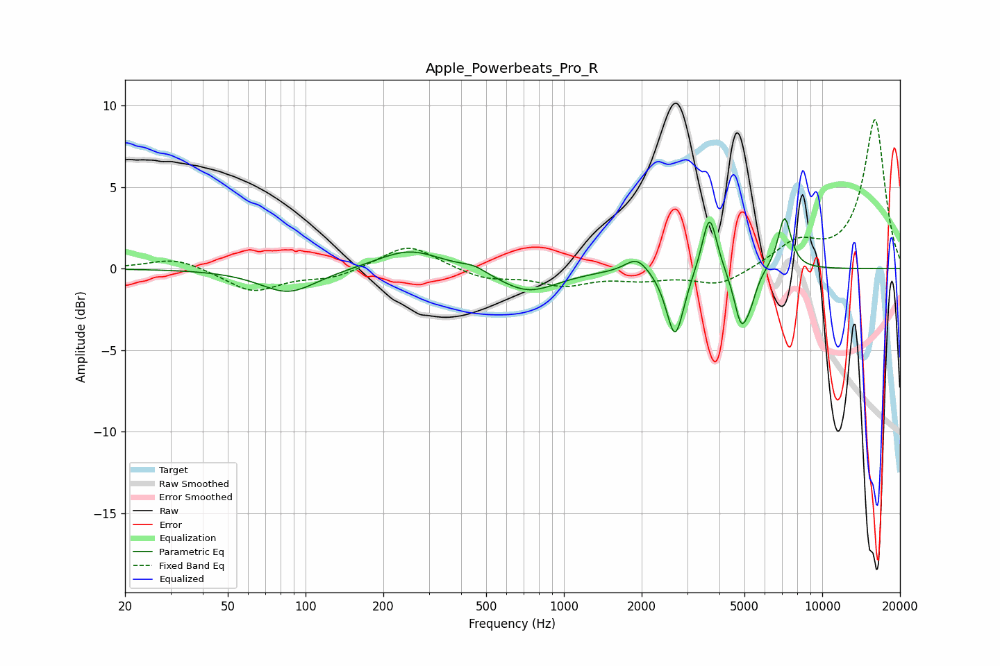

# Apple_Powerbeats_Pro_R
See [usage instructions](https://github.com/jaakkopasanen/AutoEq#usage) for more options and info.

### Parametric EQs
Apply preamp of -3.2 dB when using parametric equalizer.

|   # | Type    |   Fc (Hz) |    Q |   Gain (dB) |
|-----|---------|-----------|------|-------------|
|   1 | Peaking |        86 | 1.27 |        -1.5 |
|   2 | Peaking |       253 | 1.14 |         1.3 |
|   3 | Peaking |       448 | 2.89 |         0.3 |
|   4 | Peaking |       726 | 1.23 |        -1.4 |
|   5 | Peaking |      1918 | 3.15 |         1   |
|   6 | Peaking |      2695 | 4.19 |        -4.3 |
|   7 | Peaking |      3662 | 4.95 |         3.7 |
|   8 | Peaking |      4860 | 4.9  |        -3.3 |
|   9 | Peaking |      5294 | 6    |        -1   |
|  10 | Peaking |      7144 | 5.28 |         3.3 |

### Fixed Band EQs
When using fixed band (also called graphic) equalizer, apply preamp of **-9.2 dB** (if available) and set gains manually with these parameters.

|   # | Type    |   Fc (Hz) |    Q |   Gain (dB) |
|-----|---------|-----------|------|-------------|
|   1 | Peaking |        31 | 1.41 |         0.7 |
|   2 | Peaking |        62 | 1.41 |        -1.4 |
|   3 | Peaking |       125 | 1.41 |        -0.6 |
|   4 | Peaking |       250 | 1.41 |         1.5 |
|   5 | Peaking |       500 | 1.41 |        -0.6 |
|   6 | Peaking |      1000 | 1.41 |        -0.9 |
|   7 | Peaking |      2000 | 1.41 |        -0.5 |
|   8 | Peaking |      4000 | 1.41 |        -1   |
|   9 | Peaking |      8000 | 1.41 |         1.5 |
|  10 | Peaking |     16000 | 1.41 |         9.1 |

### Graphs

