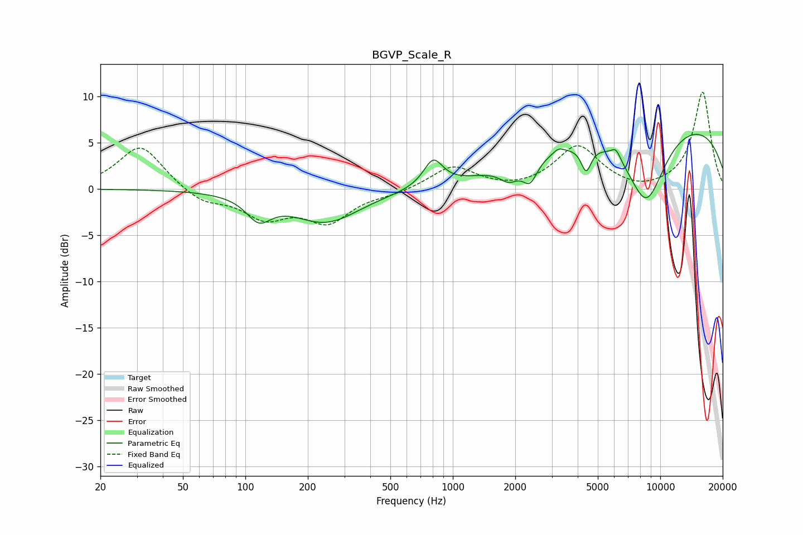

# BGVP_Scale_R
See [usage instructions](https://github.com/jaakkopasanen/AutoEq#usage) for more options and info.

### Parametric EQs
Apply preamp of -6.0 dB when using parametric equalizer.

|   # | Type    |   Fc (Hz) |    Q |   Gain (dB) |
|-----|---------|-----------|------|-------------|
|   1 | Peaking |       116 | 2.37 |        -2.5 |
|   2 | Peaking |       244 | 0.86 |        -3.5 |
|   3 | Peaking |       805 | 3.08 |         2.9 |
|   4 | Peaking |      1867 | 3.19 |        -1.5 |
|   5 | Peaking |      2356 | 4    |        -2.4 |
|   6 | Peaking |      3232 | 5.75 |         0.5 |
|   7 | Peaking |      4395 | 5.71 |        -2.7 |
|   8 | Peaking |      6113 | 5.96 |         1.1 |
|   9 | Peaking |      8554 | 1.32 |        -8.7 |
|  10 | Peaking |     10000 | 0.21 |         7.8 |

### Fixed Band EQs
When using fixed band (also called graphic) equalizer, apply preamp of **-10.6 dB** (if available) and set gains manually with these parameters.

|   # | Type    |   Fc (Hz) |    Q |   Gain (dB) |
|-----|---------|-----------|------|-------------|
|   1 | Peaking |        31 | 1.41 |         4.8 |
|   2 | Peaking |        62 | 1.41 |        -1.5 |
|   3 | Peaking |       125 | 1.41 |        -2.8 |
|   4 | Peaking |       250 | 1.41 |        -3.3 |
|   5 | Peaking |       500 | 1.41 |        -0.5 |
|   6 | Peaking |      1000 | 1.41 |         2.5 |
|   7 | Peaking |      2000 | 1.41 |        -0.2 |
|   8 | Peaking |      4000 | 1.41 |         4.6 |
|   9 | Peaking |      8000 | 1.41 |        -0.5 |
|  10 | Peaking |     16000 | 1.41 |        10.5 |

### Graphs

