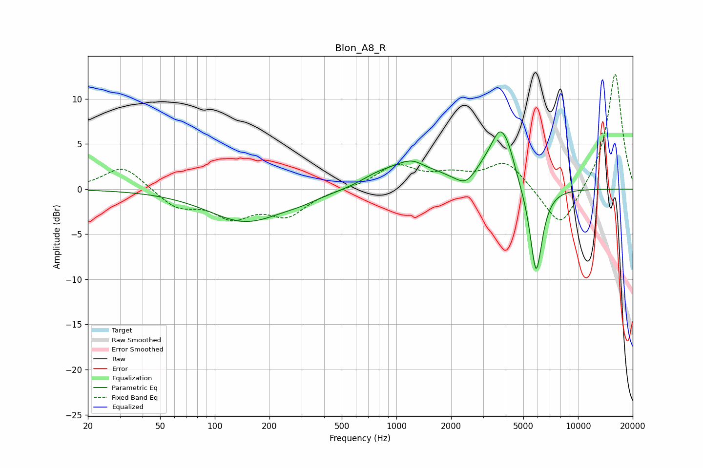

# Blon_A8_R
See [usage instructions](https://github.com/jaakkopasanen/AutoEq#usage) for more options and info.

### Parametric EQs
Apply preamp of -6.4 dB when using parametric equalizer.

|   # | Type    |   Fc (Hz) |    Q |   Gain (dB) |
|-----|---------|-----------|------|-------------|
|   1 | Peaking |       148 | 0.68 |        -3.6 |
|   2 | Peaking |       299 | 1.37 |        -0.4 |
|   3 | Peaking |       788 | 1.45 |         0.9 |
|   4 | Peaking |      1275 | 1.2  |         3.2 |
|   5 | Peaking |      1426 | 2.29 |        -0.7 |
|   6 | Peaking |      2427 | 2.54 |        -1.4 |
|   7 | Peaking |      3008 | 1.74 |         1.2 |
|   8 | Peaking |      3758 | 2.45 |         5.8 |
|   9 | Peaking |      4218 | 4.42 |         0.9 |
|  10 | Peaking |      5877 | 4.01 |       -10   |

### Fixed Band EQs
When using fixed band (also called graphic) equalizer, apply preamp of **-12.8 dB** (if available) and set gains manually with these parameters.

|   # | Type    |   Fc (Hz) |    Q |   Gain (dB) |
|-----|---------|-----------|------|-------------|
|   1 | Peaking |        31 | 1.41 |         2.7 |
|   2 | Peaking |        62 | 1.41 |        -2   |
|   3 | Peaking |       125 | 1.41 |        -2.8 |
|   4 | Peaking |       250 | 1.41 |        -2.7 |
|   5 | Peaking |       500 | 1.41 |         0   |
|   6 | Peaking |      1000 | 1.41 |         2.5 |
|   7 | Peaking |      2000 | 1.41 |         1.3 |
|   8 | Peaking |      4000 | 1.41 |         3   |
|   9 | Peaking |      8000 | 1.41 |        -4.7 |
|  10 | Peaking |     16000 | 1.41 |        13   |

### Graphs

