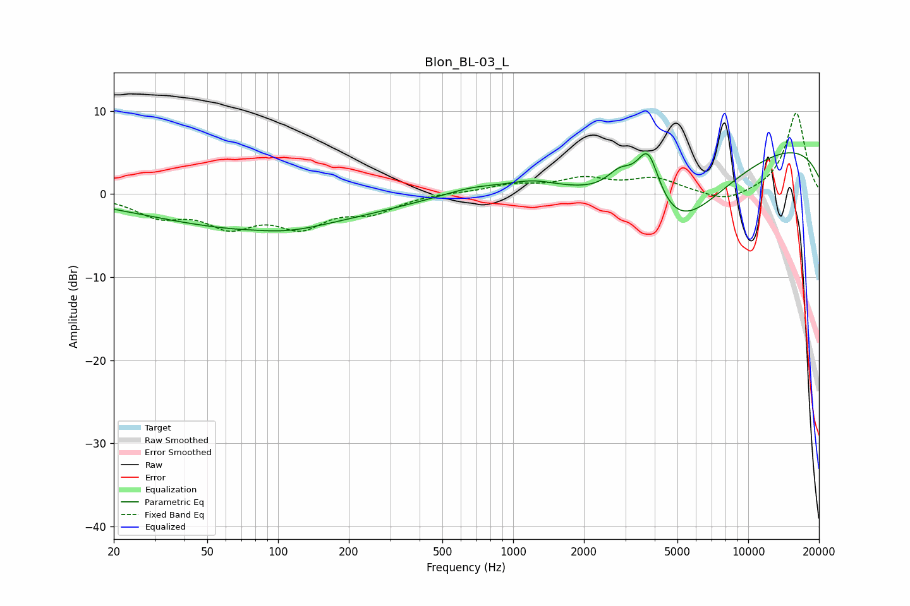

# Blon_BL-03_L
See [usage instructions](https://github.com/jaakkopasanen/AutoEq#usage) for more options and info.

### Parametric EQs
Apply preamp of -5.1 dB when using parametric equalizer.

|   # | Type    |   Fc (Hz) |    Q |   Gain (dB) |
|-----|---------|-----------|------|-------------|
|   1 | Peaking |        81 | 0.29 |        -3.9 |
|   2 | Peaking |        82 | 1.75 |         0.2 |
|   3 | Peaking |        92 | 0.96 |        -0.7 |
|   4 | Peaking |       127 | 1.66 |        -0.1 |
|   5 | Peaking |       676 | 1.07 |         0.9 |
|   6 | Peaking |      1205 | 1.44 |         1   |
|   7 | Peaking |      2855 | 2.4  |         2.7 |
|   8 | Peaking |      3749 | 2.71 |         7.1 |
|   9 | Peaking |      4859 | 0.61 |       -10.3 |
|  10 | Peaking |      9338 | 0.18 |         6.9 |

### Fixed Band EQs
When using fixed band (also called graphic) equalizer, apply preamp of **-9.8 dB** (if available) and set gains manually with these parameters.

|   # | Type    |   Fc (Hz) |    Q |   Gain (dB) |
|-----|---------|-----------|------|-------------|
|   1 | Peaking |        31 | 1.41 |        -2.3 |
|   2 | Peaking |        62 | 1.41 |        -3.4 |
|   3 | Peaking |       125 | 1.41 |        -3.4 |
|   4 | Peaking |       250 | 1.41 |        -1.9 |
|   5 | Peaking |       500 | 1.41 |         0.2 |
|   6 | Peaking |      1000 | 1.41 |         1   |
|   7 | Peaking |      2000 | 1.41 |         1.7 |
|   8 | Peaking |      4000 | 1.41 |         1.7 |
|   9 | Peaking |      8000 | 1.41 |        -1.2 |
|  10 | Peaking |     16000 | 1.41 |         9.8 |

### Graphs

