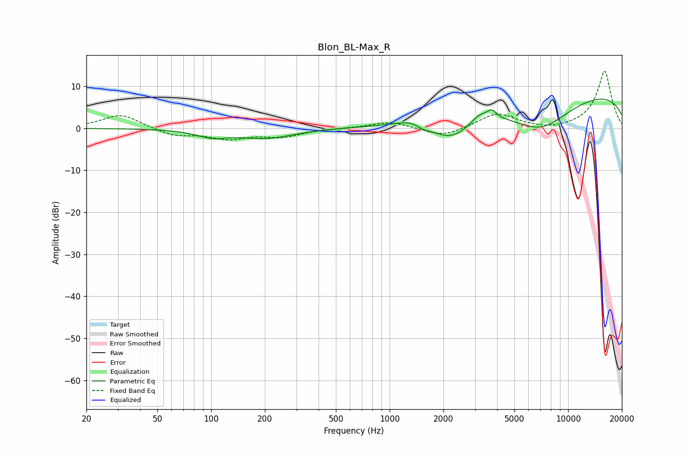

# Blon_BL-Max_R
See [usage instructions](https://github.com/jaakkopasanen/AutoEq#usage) for more options and info.

### Parametric EQs
Apply preamp of -7.0 dB when using parametric equalizer.

|   # | Type    |   Fc (Hz) |    Q |   Gain (dB) |
|-----|---------|-----------|------|-------------|
|   1 | Peaking |       101 | 1.6  |        -1.7 |
|   2 | Peaking |       203 | 0.92 |        -2.2 |
|   3 | Peaking |      1358 | 1.88 |         1.4 |
|   4 | Peaking |      1540 | 2.93 |        -1.3 |
|   5 | Peaking |      2156 | 1.4  |        -4.7 |
|   6 | Peaking |      2911 | 1.65 |        -2.3 |
|   7 | Peaking |      3148 | 2.46 |         3.2 |
|   8 | Peaking |      3739 | 5.58 |         1.8 |
|   9 | Peaking |      6991 | 0.74 |        -8.4 |
|  10 | Peaking |     10000 | 0.18 |         9.3 |

### Fixed Band EQs
When using fixed band (also called graphic) equalizer, apply preamp of **-13.7 dB** (if available) and set gains manually with these parameters.

|   # | Type    |   Fc (Hz) |    Q |   Gain (dB) |
|-----|---------|-----------|------|-------------|
|   1 | Peaking |        31 | 1.41 |         3.4 |
|   2 | Peaking |        62 | 1.41 |        -1.8 |
|   3 | Peaking |       125 | 1.41 |        -2.2 |
|   4 | Peaking |       250 | 1.41 |        -1.8 |
|   5 | Peaking |       500 | 1.41 |         0   |
|   6 | Peaking |      1000 | 1.41 |         1.6 |
|   7 | Peaking |      2000 | 1.41 |        -2.1 |
|   8 | Peaking |      4000 | 1.41 |         3.6 |
|   9 | Peaking |      8000 | 1.41 |        -0.6 |
|  10 | Peaking |     16000 | 1.41 |        13.7 |

### Graphs

