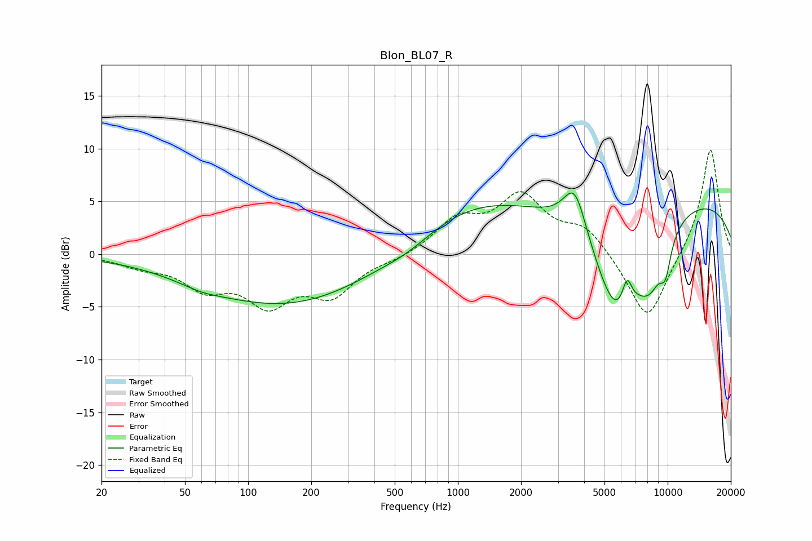

# Blon_BL07_R
See [usage instructions](https://github.com/jaakkopasanen/AutoEq#usage) for more options and info.

### Parametric EQs
Apply preamp of -5.9 dB when using parametric equalizer.

|   # | Type    |   Fc (Hz) |    Q |   Gain (dB) |
|-----|---------|-----------|------|-------------|
|   1 | Peaking |        59 | 1.52 |        -0.4 |
|   2 | Peaking |       157 | 0.33 |        -5   |
|   3 | Peaking |       583 | 1.1  |        -1   |
|   4 | Peaking |      1074 | 0.45 |         4.2 |
|   5 | Peaking |      3609 | 2.55 |         4.6 |
|   6 | Peaking |      5695 | 1.13 |       -10.3 |
|   7 | Peaking |      6400 | 5.91 |         2.5 |
|   8 | Peaking |      8237 | 1.83 |        -4.5 |
|   9 | Peaking |      9508 | 0.19 |         5.7 |
|  10 | Peaking |      9763 | 4.73 |        -2.8 |

### Fixed Band EQs
When using fixed band (also called graphic) equalizer, apply preamp of **-10.0 dB** (if available) and set gains manually with these parameters.

|   # | Type    |   Fc (Hz) |    Q |   Gain (dB) |
|-----|---------|-----------|------|-------------|
|   1 | Peaking |        31 | 1.41 |        -0.9 |
|   2 | Peaking |        62 | 1.41 |        -2.8 |
|   3 | Peaking |       125 | 1.41 |        -4.2 |
|   4 | Peaking |       250 | 1.41 |        -3.5 |
|   5 | Peaking |       500 | 1.41 |        -0.5 |
|   6 | Peaking |      1000 | 1.41 |         3   |
|   7 | Peaking |      2000 | 1.41 |         5.2 |
|   8 | Peaking |      4000 | 1.41 |         2.4 |
|   9 | Peaking |      8000 | 1.41 |        -6.6 |
|  10 | Peaking |     16000 | 1.41 |        10.2 |

### Graphs

