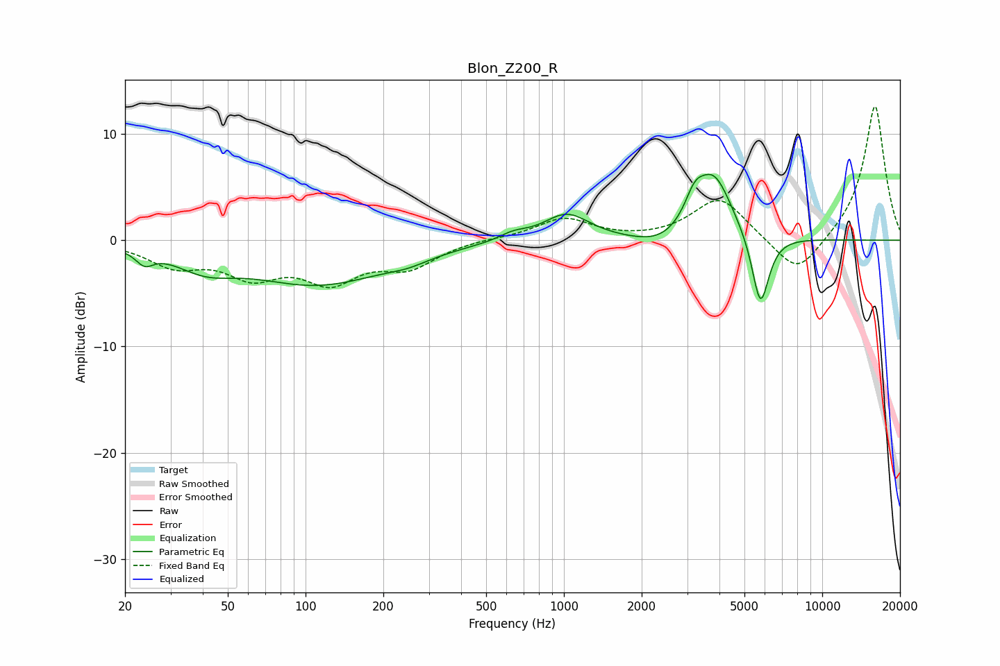

# Blon_Z200_R
See [usage instructions](https://github.com/jaakkopasanen/AutoEq#usage) for more options and info.

### Parametric EQs
Apply preamp of -6.3 dB when using parametric equalizer.

|   # | Type    |   Fc (Hz) |    Q |   Gain (dB) |
|-----|---------|-----------|------|-------------|
|   1 | Peaking |        24 | 4.29 |        -1.2 |
|   2 | Peaking |        41 | 1.22 |        -1.8 |
|   3 | Peaking |       112 | 0.53 |        -4   |
|   4 | Peaking |       249 | 1.71 |        -0.6 |
|   5 | Peaking |       636 | 2.55 |         0.6 |
|   6 | Peaking |      1025 | 1.58 |         2.5 |
|   7 | Peaking |      2381 | 1.42 |        -1.1 |
|   8 | Peaking |      3200 | 3.85 |         2.1 |
|   9 | Peaking |      3800 | 1.92 |         6.1 |
|  10 | Peaking |      5765 | 4.11 |        -7   |

### Fixed Band EQs
When using fixed band (also called graphic) equalizer, apply preamp of **-12.7 dB** (if available) and set gains manually with these parameters.

|   # | Type    |   Fc (Hz) |    Q |   Gain (dB) |
|-----|---------|-----------|------|-------------|
|   1 | Peaking |        31 | 1.41 |        -2.2 |
|   2 | Peaking |        62 | 1.41 |        -2.9 |
|   3 | Peaking |       125 | 1.41 |        -3.4 |
|   4 | Peaking |       250 | 1.41 |        -2.3 |
|   5 | Peaking |       500 | 1.41 |         0.2 |
|   6 | Peaking |      1000 | 1.41 |         2   |
|   7 | Peaking |      2000 | 1.41 |        -0.1 |
|   8 | Peaking |      4000 | 1.41 |         4   |
|   9 | Peaking |      8000 | 1.41 |        -3.6 |
|  10 | Peaking |     16000 | 1.41 |        12.8 |

### Graphs

