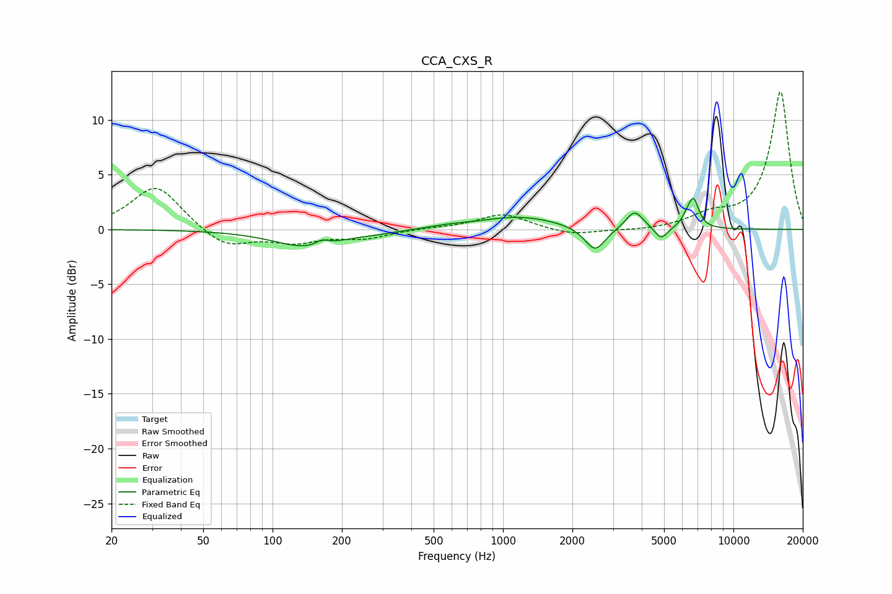

# CCA_CXS_R
See [usage instructions](https://github.com/jaakkopasanen/AutoEq#usage) for more options and info.

### Parametric EQs
Apply preamp of -2.9 dB when using parametric equalizer.

|   # | Type    |   Fc (Hz) |    Q |   Gain (dB) |
|-----|---------|-----------|------|-------------|
|   1 | Peaking |       141 | 0.98 |        -1.6 |
|   2 | Peaking |       164 | 5.02 |         0.5 |
|   3 | Peaking |       289 | 1.73 |        -0.1 |
|   4 | Peaking |       585 | 1.91 |         0.2 |
|   5 | Peaking |      1172 | 0.81 |         1.2 |
|   6 | Peaking |      2508 | 3.12 |        -2.3 |
|   7 | Peaking |      3725 | 3.77 |         1.7 |
|   8 | Peaking |      4858 | 5.08 |        -1.2 |
|   9 | Peaking |      6291 | 6    |         0.7 |
|  10 | Peaking |      6720 | 5.97 |         2.5 |

### Fixed Band EQs
When using fixed band (also called graphic) equalizer, apply preamp of **-12.6 dB** (if available) and set gains manually with these parameters.

|   # | Type    |   Fc (Hz) |    Q |   Gain (dB) |
|-----|---------|-----------|------|-------------|
|   1 | Peaking |        31 | 1.41 |         4.1 |
|   2 | Peaking |        62 | 1.41 |        -1.7 |
|   3 | Peaking |       125 | 1.41 |        -1.1 |
|   4 | Peaking |       250 | 1.41 |        -0.8 |
|   5 | Peaking |       500 | 1.41 |         0.1 |
|   6 | Peaking |      1000 | 1.41 |         1.4 |
|   7 | Peaking |      2000 | 1.41 |        -0.6 |
|   8 | Peaking |      4000 | 1.41 |        -0.2 |
|   9 | Peaking |      8000 | 1.41 |         1.1 |
|  10 | Peaking |     16000 | 1.41 |        12.6 |

### Graphs

