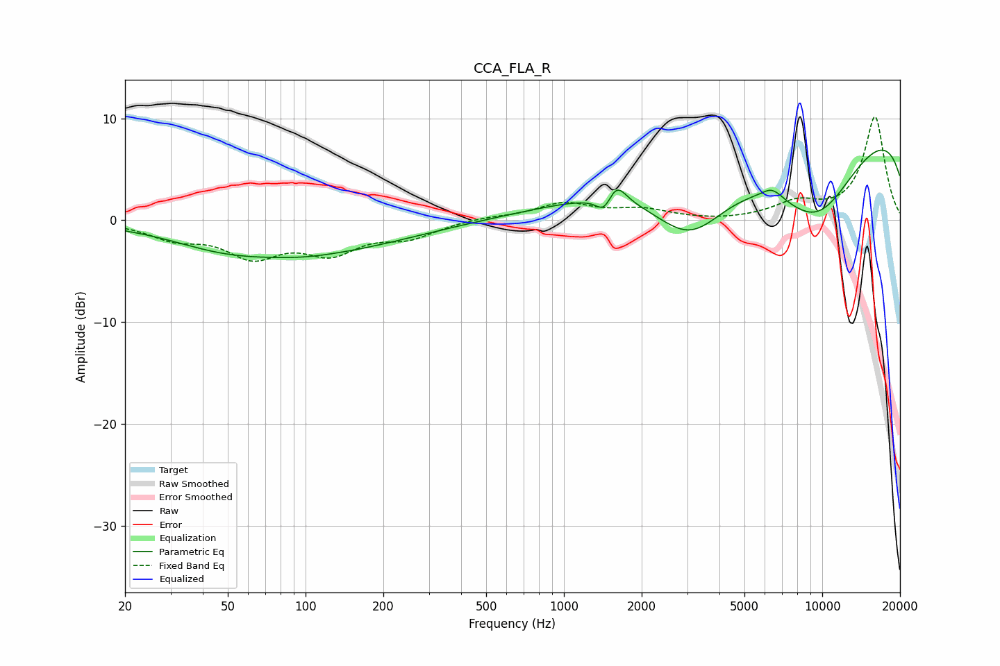

# CCA_FLA_R
See [usage instructions](https://github.com/jaakkopasanen/AutoEq#usage) for more options and info.

### Parametric EQs
Apply preamp of -7.0 dB when using parametric equalizer.

|   # | Type    |   Fc (Hz) |    Q |   Gain (dB) |
|-----|---------|-----------|------|-------------|
|   1 | Peaking |        47 | 0.75 |        -1   |
|   2 | Peaking |        99 | 1.43 |        -0.1 |
|   3 | Peaking |       101 | 0.38 |        -3.1 |
|   4 | Peaking |      1251 | 0.4  |         0.5 |
|   5 | Peaking |      1432 | 4.71 |        -1.6 |
|   6 | Peaking |      1597 | 3.91 |         2   |
|   7 | Peaking |      3077 | 0.89 |        -7.2 |
|   8 | Peaking |      6407 | 3.21 |         1.1 |
|   9 | Peaking |      9445 | 0.55 |       -12.5 |
|  10 | Peaking |     10000 | 0.19 |        14.1 |

### Fixed Band EQs
When using fixed band (also called graphic) equalizer, apply preamp of **-10.2 dB** (if available) and set gains manually with these parameters.

|   # | Type    |   Fc (Hz) |    Q |   Gain (dB) |
|-----|---------|-----------|------|-------------|
|   1 | Peaking |        31 | 1.41 |        -1.5 |
|   2 | Peaking |        62 | 1.41 |        -3.2 |
|   3 | Peaking |       125 | 1.41 |        -2.8 |
|   4 | Peaking |       250 | 1.41 |        -1.5 |
|   5 | Peaking |       500 | 1.41 |         0.3 |
|   6 | Peaking |      1000 | 1.41 |         1.6 |
|   7 | Peaking |      2000 | 1.41 |         0.9 |
|   8 | Peaking |      4000 | 1.41 |        -0.1 |
|   9 | Peaking |      8000 | 1.41 |         1.5 |
|  10 | Peaking |     16000 | 1.41 |        10.1 |

### Graphs

