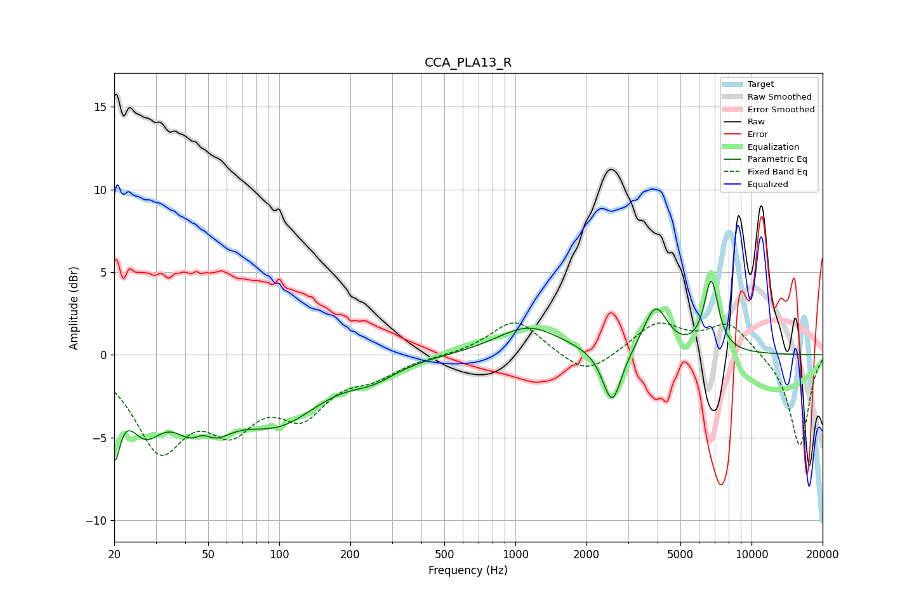

# CCA_PLA13_R
See [usage instructions](https://github.com/jaakkopasanen/AutoEq#usage) for more options and info.

### Parametric EQs
Apply preamp of -4.6 dB when using parametric equalizer.

|   # | Type    |   Fc (Hz) |    Q |   Gain (dB) |
|-----|---------|-----------|------|-------------|
|   1 | Peaking |        20 | 5.94 |        -4.2 |
|   2 | Peaking |        27 | 1.89 |        -3.3 |
|   3 | Peaking |        47 | 1.57 |        -5   |
|   4 | Peaking |        47 | 2.91 |         2.1 |
|   5 | Peaking |        99 | 0.77 |        -3.6 |
|   6 | Peaking |       249 | 1.44 |        -0.8 |
|   7 | Peaking |      1135 | 1.05 |         1.7 |
|   8 | Peaking |      2568 | 3.54 |        -3.4 |
|   9 | Peaking |      3921 | 2.77 |         2.8 |
|  10 | Peaking |      6754 | 4.5  |         4.3 |

### Fixed Band EQs
When using fixed band (also called graphic) equalizer, apply preamp of **-2.0 dB** (if available) and set gains manually with these parameters.

|   # | Type    |   Fc (Hz) |    Q |   Gain (dB) |
|-----|---------|-----------|------|-------------|
|   1 | Peaking |        31 | 1.41 |        -5.3 |
|   2 | Peaking |        62 | 1.41 |        -3.6 |
|   3 | Peaking |       125 | 1.41 |        -3.1 |
|   4 | Peaking |       250 | 1.41 |        -1   |
|   5 | Peaking |       500 | 1.41 |        -0   |
|   6 | Peaking |      1000 | 1.41 |         2.2 |
|   7 | Peaking |      2000 | 1.41 |        -1.4 |
|   8 | Peaking |      4000 | 1.41 |         1.9 |
|   9 | Peaking |      8000 | 1.41 |         1.9 |
|  10 | Peaking |     16000 | 1.41 |        -5.6 |

### Graphs

