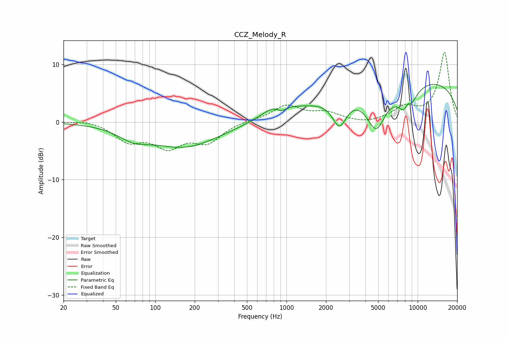

# CCZ_Melody_R
See [usage instructions](https://github.com/jaakkopasanen/AutoEq#usage) for more options and info.

### Parametric EQs
Apply preamp of -6.6 dB when using parametric equalizer.

|   # | Type    |   Fc (Hz) |    Q |   Gain (dB) |
|-----|---------|-----------|------|-------------|
|   1 | Peaking |        68 | 1.24 |        -1.8 |
|   2 | Peaking |       169 | 0.54 |        -4.2 |
|   3 | Peaking |       838 | 1.41 |         2.3 |
|   4 | Peaking |       916 | 3.31 |        -1.3 |
|   5 | Peaking |      1084 | 1.09 |         0.3 |
|   6 | Peaking |      2535 | 2.59 |        -4.9 |
|   7 | Peaking |      4821 | 1.83 |        -7.3 |
|   8 | Peaking |      8293 | 2.39 |        -6.7 |
|   9 | Peaking |      8374 | 4.71 |         3.3 |
|  10 | Peaking |      8769 | 0.18 |         7.7 |

### Fixed Band EQs
When using fixed band (also called graphic) equalizer, apply preamp of **-12.2 dB** (if available) and set gains manually with these parameters.

|   # | Type    |   Fc (Hz) |    Q |   Gain (dB) |
|-----|---------|-----------|------|-------------|
|   1 | Peaking |        31 | 1.41 |         0.4 |
|   2 | Peaking |        62 | 1.41 |        -3   |
|   3 | Peaking |       125 | 1.41 |        -3.9 |
|   4 | Peaking |       250 | 1.41 |        -3.2 |
|   5 | Peaking |       500 | 1.41 |         0.3 |
|   6 | Peaking |      1000 | 1.41 |         2.8 |
|   7 | Peaking |      2000 | 1.41 |         1.4 |
|   8 | Peaking |      4000 | 1.41 |        -0.4 |
|   9 | Peaking |      8000 | 1.41 |         2.3 |
|  10 | Peaking |     16000 | 1.41 |        12   |

### Graphs

