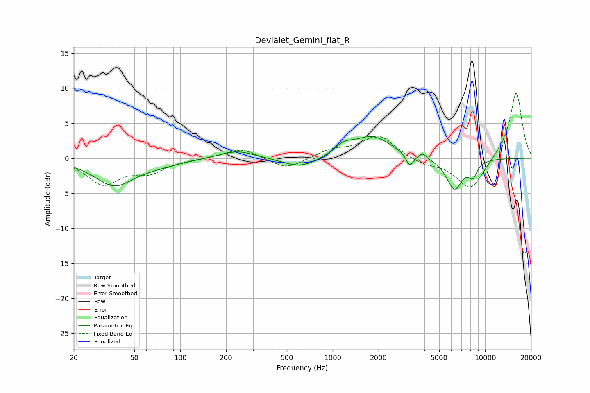

# Devialet_Gemini_flat_R
See [usage instructions](https://github.com/jaakkopasanen/AutoEq#usage) for more options and info.

### Parametric EQs
Apply preamp of -3.2 dB when using parametric equalizer.

|   # | Type    |   Fc (Hz) |    Q |   Gain (dB) |
|-----|---------|-----------|------|-------------|
|   1 | Peaking |        37 | 1.1  |        -3.8 |
|   2 | Peaking |        72 | 1    |        -0.6 |
|   3 | Peaking |       236 | 1.26 |         1.2 |
|   4 | Peaking |       616 | 1.25 |        -1.5 |
|   5 | Peaking |      1177 | 2.49 |         1.2 |
|   6 | Peaking |      1811 | 1.12 |         3.1 |
|   7 | Peaking |      3202 | 5.8  |        -1.8 |
|   8 | Peaking |      3897 | 6    |         0.7 |
|   9 | Peaking |      6290 | 2.56 |        -4.4 |
|  10 | Peaking |      8306 | 4.7  |        -1.9 |

### Fixed Band EQs
When using fixed band (also called graphic) equalizer, apply preamp of **-9.4 dB** (if available) and set gains manually with these parameters.

|   # | Type    |   Fc (Hz) |    Q |   Gain (dB) |
|-----|---------|-----------|------|-------------|
|   1 | Peaking |        31 | 1.41 |        -3.6 |
|   2 | Peaking |        62 | 1.41 |        -1.8 |
|   3 | Peaking |       125 | 1.41 |        -0   |
|   4 | Peaking |       250 | 1.41 |         1.5 |
|   5 | Peaking |       500 | 1.41 |        -1.6 |
|   6 | Peaking |      1000 | 1.41 |         1.1 |
|   7 | Peaking |      2000 | 1.41 |         3.2 |
|   8 | Peaking |      4000 | 1.41 |        -0.9 |
|   9 | Peaking |      8000 | 1.41 |        -4.6 |
|  10 | Peaking |     16000 | 1.41 |         9.6 |

### Graphs

