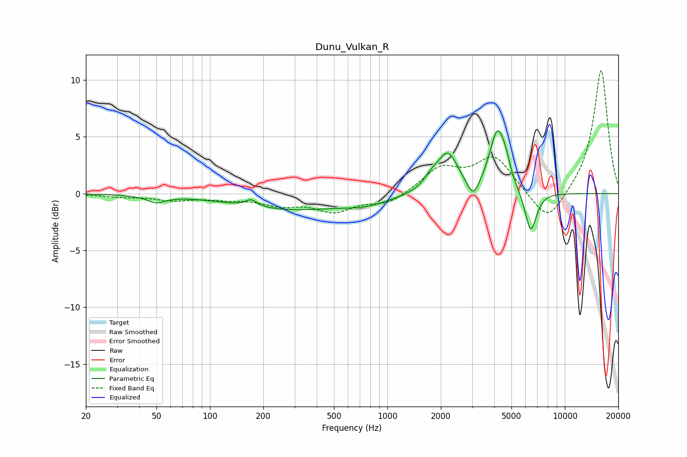

# Dunu_Vulkan_R
See [usage instructions](https://github.com/jaakkopasanen/AutoEq#usage) for more options and info.

### Parametric EQs
Apply preamp of -5.6 dB when using parametric equalizer.

|   # | Type    |   Fc (Hz) |    Q |   Gain (dB) |
|-----|---------|-----------|------|-------------|
|   1 | Peaking |        50 | 2.74 |        -0.6 |
|   2 | Peaking |       171 | 4.4  |         0.6 |
|   3 | Peaking |       281 | 0.44 |        -1.3 |
|   4 | Peaking |       764 | 1.07 |        -0.6 |
|   5 | Peaking |      1757 | 3.43 |         0.8 |
|   6 | Peaking |      2186 | 2.4  |         3.4 |
|   7 | Peaking |      3050 | 4.17 |        -1.6 |
|   8 | Peaking |      4174 | 3.14 |         5.4 |
|   9 | Peaking |      4650 | 6    |         0.9 |
|  10 | Peaking |      6421 | 4.16 |        -3.7 |

### Fixed Band EQs
When using fixed band (also called graphic) equalizer, apply preamp of **-10.9 dB** (if available) and set gains manually with these parameters.

|   # | Type    |   Fc (Hz) |    Q |   Gain (dB) |
|-----|---------|-----------|------|-------------|
|   1 | Peaking |        31 | 1.41 |        -0.2 |
|   2 | Peaking |        62 | 1.41 |        -0.5 |
|   3 | Peaking |       125 | 1.41 |        -0.4 |
|   4 | Peaking |       250 | 1.41 |        -0.9 |
|   5 | Peaking |       500 | 1.41 |        -1.5 |
|   6 | Peaking |      1000 | 1.41 |        -0.9 |
|   7 | Peaking |      2000 | 1.41 |         2.1 |
|   8 | Peaking |      4000 | 1.41 |         3.2 |
|   9 | Peaking |      8000 | 1.41 |        -2.8 |
|  10 | Peaking |     16000 | 1.41 |        11   |

### Graphs

