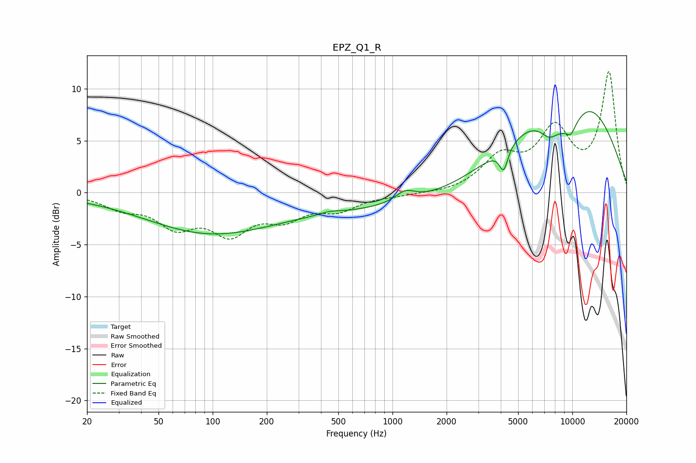

# EPZ_Q1_R
See [usage instructions](https://github.com/jaakkopasanen/AutoEq#usage) for more options and info.

### Parametric EQs
Apply preamp of -7.9 dB when using parametric equalizer.

|   # | Type    |   Fc (Hz) |    Q |   Gain (dB) |
|-----|---------|-----------|------|-------------|
|   1 | Peaking |        21 | 0.42 |        -0.2 |
|   2 | Peaking |        87 | 0.42 |        -3.2 |
|   3 | Peaking |       446 | 2.51 |         0.3 |
|   4 | Peaking |       613 | 0.18 |        -1.6 |
|   5 | Peaking |      1178 | 2.54 |         1   |
|   6 | Peaking |      4155 | 5.82 |        -2.2 |
|   7 | Peaking |      7432 | 2.44 |        -1.8 |
|   8 | Peaking |      9468 | 1.21 |        -4.7 |
|   9 | Peaking |      9785 | 0.42 |        11.6 |
|  10 | Peaking |      9853 | 5.29 |        -0.8 |

### Fixed Band EQs
When using fixed band (also called graphic) equalizer, apply preamp of **-11.7 dB** (if available) and set gains manually with these parameters.

|   # | Type    |   Fc (Hz) |    Q |   Gain (dB) |
|-----|---------|-----------|------|-------------|
|   1 | Peaking |        31 | 1.41 |        -1.3 |
|   2 | Peaking |        62 | 1.41 |        -2.9 |
|   3 | Peaking |       125 | 1.41 |        -3.5 |
|   4 | Peaking |       250 | 1.41 |        -2.1 |
|   5 | Peaking |       500 | 1.41 |        -1.5 |
|   6 | Peaking |      1000 | 1.41 |        -0.2 |
|   7 | Peaking |      2000 | 1.41 |        -0.1 |
|   8 | Peaking |      4000 | 1.41 |         3.1 |
|   9 | Peaking |      8000 | 1.41 |         5.6 |
|  10 | Peaking |     16000 | 1.41 |        11.4 |

### Graphs

