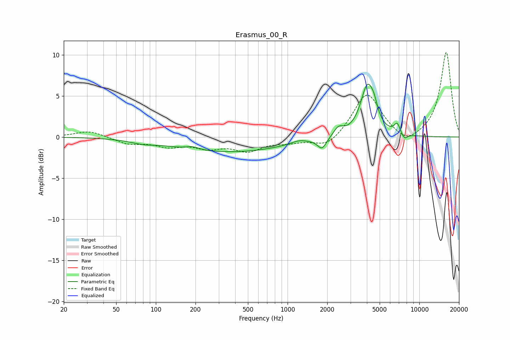

# Erasmus_00_R
See [usage instructions](https://github.com/jaakkopasanen/AutoEq#usage) for more options and info.

### Parametric EQs
Apply preamp of -6.5 dB when using parametric equalizer.

|   # | Type    |   Fc (Hz) |    Q |   Gain (dB) |
|-----|---------|-----------|------|-------------|
|   1 | Peaking |        80 | 1.69 |        -0.3 |
|   2 | Peaking |       191 | 3.08 |         0.3 |
|   3 | Peaking |       360 | 0.33 |        -1.8 |
|   4 | Peaking |      1219 | 2.41 |         0.4 |
|   5 | Peaking |      1825 | 4.2  |        -1.3 |
|   6 | Peaking |      2434 | 3.79 |         1.1 |
|   7 | Peaking |      4048 | 2.64 |         6.2 |
|   8 | Peaking |      4544 | 6    |         1   |
|   9 | Peaking |      6790 | 6    |         1.3 |
|  10 | Peaking |      7697 | 5.84 |        -0.7 |

### Fixed Band EQs
When using fixed band (also called graphic) equalizer, apply preamp of **-10.4 dB** (if available) and set gains manually with these parameters.

|   # | Type    |   Fc (Hz) |    Q |   Gain (dB) |
|-----|---------|-----------|------|-------------|
|   1 | Peaking |        31 | 1.41 |         0.8 |
|   2 | Peaking |        62 | 1.41 |        -0.8 |
|   3 | Peaking |       125 | 1.41 |        -1   |
|   4 | Peaking |       250 | 1.41 |        -1.1 |
|   5 | Peaking |       500 | 1.41 |        -1.5 |
|   6 | Peaking |      1000 | 1.41 |        -0.5 |
|   7 | Peaking |      2000 | 1.41 |        -1.4 |
|   8 | Peaking |      4000 | 1.41 |         5.4 |
|   9 | Peaking |      8000 | 1.41 |        -1.2 |
|  10 | Peaking |     16000 | 1.41 |        10.3 |

### Graphs

