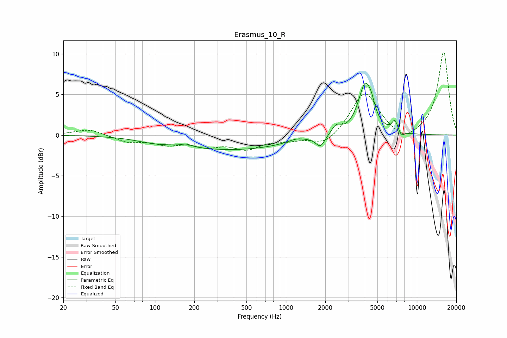

# Erasmus_10_R
See [usage instructions](https://github.com/jaakkopasanen/AutoEq#usage) for more options and info.

### Parametric EQs
Apply preamp of -6.5 dB when using parametric equalizer.

|   # | Type    |   Fc (Hz) |    Q |   Gain (dB) |
|-----|---------|-----------|------|-------------|
|   1 | Peaking |        96 | 1.15 |        -0.4 |
|   2 | Peaking |       174 | 3.72 |         0.3 |
|   3 | Peaking |       385 | 0.32 |        -1.8 |
|   4 | Peaking |      1205 | 2.24 |         0.4 |
|   5 | Peaking |      1833 | 4.32 |        -1.3 |
|   6 | Peaking |      2423 | 3.82 |         1.1 |
|   7 | Peaking |      4035 | 2.65 |         6.2 |
|   8 | Peaking |      4511 | 6    |         0.9 |
|   9 | Peaking |      6809 | 5.99 |         1.4 |
|  10 | Peaking |      7591 | 5.8  |        -0.7 |

### Fixed Band EQs
When using fixed band (also called graphic) equalizer, apply preamp of **-10.3 dB** (if available) and set gains manually with these parameters.

|   # | Type    |   Fc (Hz) |    Q |   Gain (dB) |
|-----|---------|-----------|------|-------------|
|   1 | Peaking |        31 | 1.41 |         0.8 |
|   2 | Peaking |        62 | 1.41 |        -0.8 |
|   3 | Peaking |       125 | 1.41 |        -1   |
|   4 | Peaking |       250 | 1.41 |        -1.1 |
|   5 | Peaking |       500 | 1.41 |        -1.5 |
|   6 | Peaking |      1000 | 1.41 |        -0.5 |
|   7 | Peaking |      2000 | 1.41 |        -1.4 |
|   8 | Peaking |      4000 | 1.41 |         5.4 |
|   9 | Peaking |      8000 | 1.41 |        -1.2 |
|  10 | Peaking |     16000 | 1.41 |        10.3 |

### Graphs

