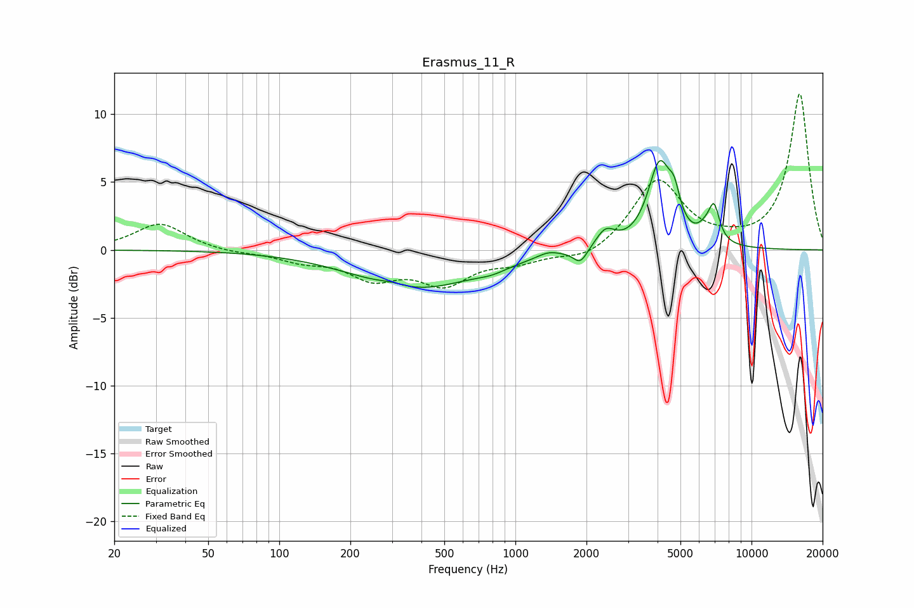

# Erasmus_11_R
See [usage instructions](https://github.com/jaakkopasanen/AutoEq#usage) for more options and info.

### Parametric EQs
Apply preamp of -6.7 dB when using parametric equalizer.

|   # | Type    |   Fc (Hz) |    Q |   Gain (dB) |
|-----|---------|-----------|------|-------------|
|   1 | Peaking |       299 | 2.47 |         0.3 |
|   2 | Peaking |       380 | 0.55 |        -2.8 |
|   3 | Peaking |       795 | 2.15 |        -0.4 |
|   4 | Peaking |      1375 | 3.15 |         0.4 |
|   5 | Peaking |      1884 | 4.79 |        -1.1 |
|   6 | Peaking |      2407 | 3.47 |         1.3 |
|   7 | Peaking |      4081 | 2.85 |         6.1 |
|   8 | Peaking |      4710 | 6    |         1.8 |
|   9 | Peaking |      6363 | 4.5  |         0.7 |
|  10 | Peaking |      6941 | 5.93 |         2.5 |

### Fixed Band EQs
When using fixed band (also called graphic) equalizer, apply preamp of **-11.6 dB** (if available) and set gains manually with these parameters.

|   # | Type    |   Fc (Hz) |    Q |   Gain (dB) |
|-----|---------|-----------|------|-------------|
|   1 | Peaking |        31 | 1.41 |         2   |
|   2 | Peaking |        62 | 1.41 |        -0.2 |
|   3 | Peaking |       125 | 1.41 |        -0.7 |
|   4 | Peaking |       250 | 1.41 |        -1.9 |
|   5 | Peaking |       500 | 1.41 |        -2.3 |
|   6 | Peaking |      1000 | 1.41 |        -0.8 |
|   7 | Peaking |      2000 | 1.41 |        -0.8 |
|   8 | Peaking |      4000 | 1.41 |         5.2 |
|   9 | Peaking |      8000 | 1.41 |         0.3 |
|  10 | Peaking |     16000 | 1.41 |        11.5 |

### Graphs

