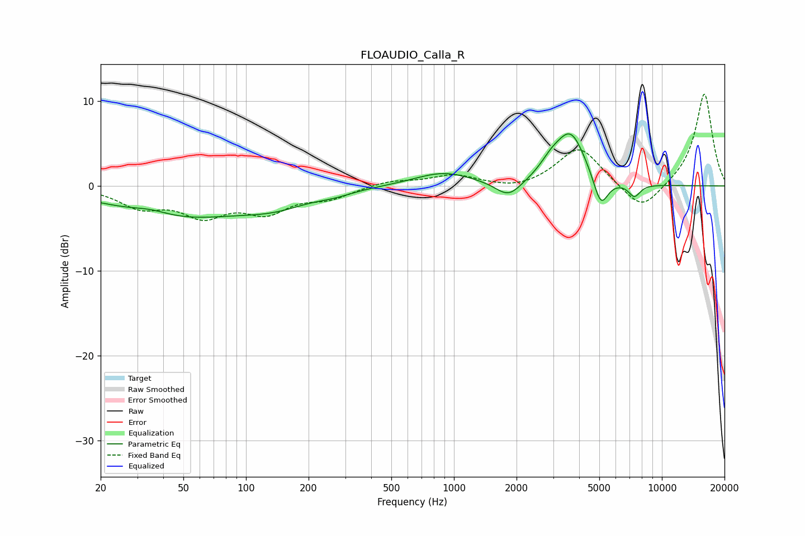

# FLOAUDIO_Calla_R
See [usage instructions](https://github.com/jaakkopasanen/AutoEq#usage) for more options and info.

### Parametric EQs
Apply preamp of -6.2 dB when using parametric equalizer.

|   # | Type    |   Fc (Hz) |    Q |   Gain (dB) |
|-----|---------|-----------|------|-------------|
|   1 | Peaking |        35 | 1.51 |         0.7 |
|   2 | Peaking |        46 | 0.44 |        -3.6 |
|   3 | Peaking |       137 | 0.85 |        -1.6 |
|   4 | Peaking |       267 | 1.61 |        -0.5 |
|   5 | Peaking |       887 | 1.02 |         1.6 |
|   6 | Peaking |      1831 | 2.26 |        -2   |
|   7 | Peaking |      2925 | 2.67 |         1.3 |
|   8 | Peaking |      3642 | 1.91 |         6.1 |
|   9 | Peaking |      5081 | 3.9  |        -3.8 |
|  10 | Peaking |      7371 | 4.74 |        -1.5 |

### Fixed Band EQs
When using fixed band (also called graphic) equalizer, apply preamp of **-10.9 dB** (if available) and set gains manually with these parameters.

|   # | Type    |   Fc (Hz) |    Q |   Gain (dB) |
|-----|---------|-----------|------|-------------|
|   1 | Peaking |        31 | 1.41 |        -2.2 |
|   2 | Peaking |        62 | 1.41 |        -3.1 |
|   3 | Peaking |       125 | 1.41 |        -2.8 |
|   4 | Peaking |       250 | 1.41 |        -1.3 |
|   5 | Peaking |       500 | 1.41 |         0.6 |
|   6 | Peaking |      1000 | 1.41 |         1.2 |
|   7 | Peaking |      2000 | 1.41 |        -0.6 |
|   8 | Peaking |      4000 | 1.41 |         4.6 |
|   9 | Peaking |      8000 | 1.41 |        -3.3 |
|  10 | Peaking |     16000 | 1.41 |        11   |

### Graphs

