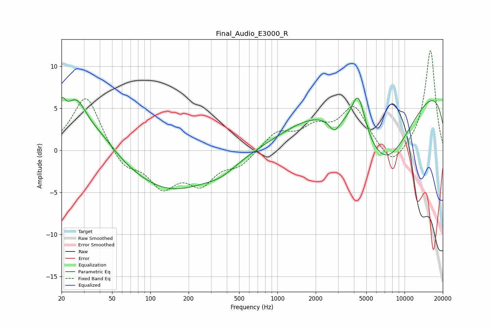

# Final_Audio_E3000_R
See [usage instructions](https://github.com/jaakkopasanen/AutoEq#usage) for more options and info.

### Parametric EQs
Apply preamp of -6.4 dB when using parametric equalizer.

|   # | Type    |   Fc (Hz) |    Q |   Gain (dB) |
|-----|---------|-----------|------|-------------|
|   1 | Peaking |        20 | 4.84 |         3   |
|   2 | Peaking |        26 | 1.58 |         5.4 |
|   3 | Peaking |        41 | 1.14 |         1.8 |
|   4 | Peaking |       145 | 0.44 |        -4.7 |
|   5 | Peaking |       360 | 1.14 |        -1.1 |
|   6 | Peaking |      1927 | 0.53 |         1.9 |
|   7 | Peaking |      2806 | 3.5  |        -1.6 |
|   8 | Peaking |      4326 | 2.57 |         5.2 |
|   9 | Peaking |      6998 | 0.52 |       -10.9 |
|  10 | Peaking |     10000 | 0.18 |         9.8 |

### Fixed Band EQs
When using fixed band (also called graphic) equalizer, apply preamp of **-11.9 dB** (if available) and set gains manually with these parameters.

|   # | Type    |   Fc (Hz) |    Q |   Gain (dB) |
|-----|---------|-----------|------|-------------|
|   1 | Peaking |        31 | 1.41 |         6.7 |
|   2 | Peaking |        62 | 1.41 |        -2.2 |
|   3 | Peaking |       125 | 1.41 |        -4   |
|   4 | Peaking |       250 | 1.41 |        -3.5 |
|   5 | Peaking |       500 | 1.41 |        -1.6 |
|   6 | Peaking |      1000 | 1.41 |         2.1 |
|   7 | Peaking |      2000 | 1.41 |         2.3 |
|   8 | Peaking |      4000 | 1.41 |         4.9 |
|   9 | Peaking |      8000 | 1.41 |        -2.3 |
|  10 | Peaking |     16000 | 1.41 |        12   |

### Graphs

