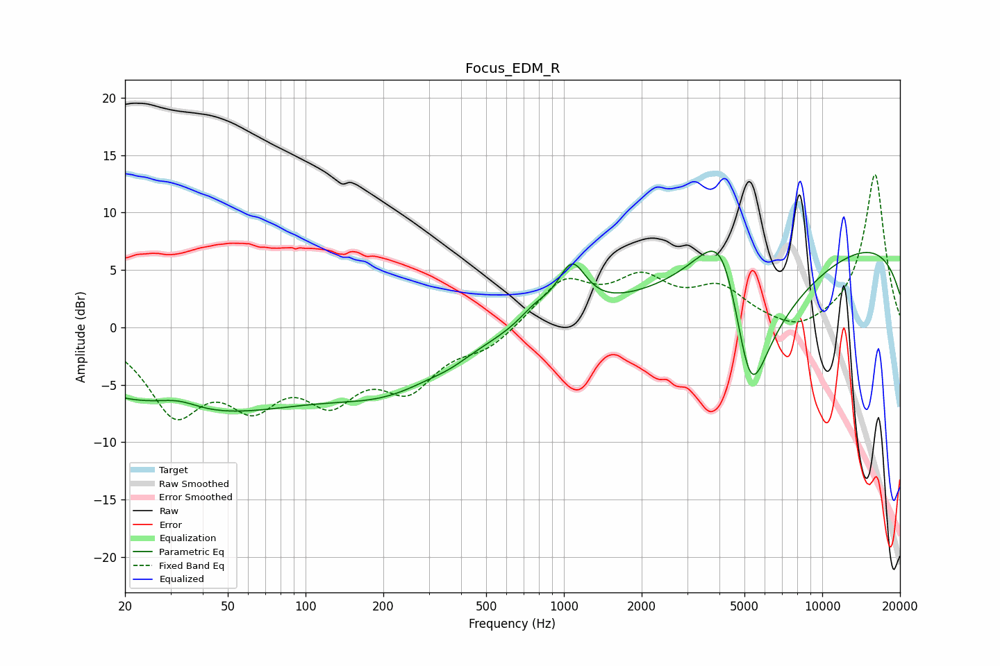

# Focus_EDM_R
See [usage instructions](https://github.com/jaakkopasanen/AutoEq#usage) for more options and info.

### Parametric EQs
Apply preamp of -6.7 dB when using parametric equalizer.

|   # | Type    |   Fc (Hz) |    Q |   Gain (dB) |
|-----|---------|-----------|------|-------------|
|   1 | Peaking |        28 | 1.4  |         0.4 |
|   2 | Peaking |        33 | 1.85 |         0.7 |
|   3 | Peaking |        37 | 0.28 |        -7.3 |
|   4 | Peaking |       217 | 0.62 |        -3.8 |
|   5 | Peaking |       365 | 2.03 |        -0.4 |
|   6 | Peaking |       774 | 2.3  |         1.2 |
|   7 | Peaking |      1074 | 2.56 |         4.4 |
|   8 | Peaking |      4153 | 1.19 |        12.3 |
|   9 | Peaking |      5257 | 1.13 |       -20   |
|  10 | Peaking |     10000 | 0.18 |         8.4 |

### Fixed Band EQs
When using fixed band (also called graphic) equalizer, apply preamp of **-13.4 dB** (if available) and set gains manually with these parameters.

|   # | Type    |   Fc (Hz) |    Q |   Gain (dB) |
|-----|---------|-----------|------|-------------|
|   1 | Peaking |        31 | 1.41 |        -6.8 |
|   2 | Peaking |        62 | 1.41 |        -5.3 |
|   3 | Peaking |       125 | 1.41 |        -5.1 |
|   4 | Peaking |       250 | 1.41 |        -4.6 |
|   5 | Peaking |       500 | 1.41 |        -1.6 |
|   6 | Peaking |      1000 | 1.41 |         3.9 |
|   7 | Peaking |      2000 | 1.41 |         3.7 |
|   8 | Peaking |      4000 | 1.41 |         3   |
|   9 | Peaking |      8000 | 1.41 |        -1   |
|  10 | Peaking |     16000 | 1.41 |        13.4 |

### Graphs

