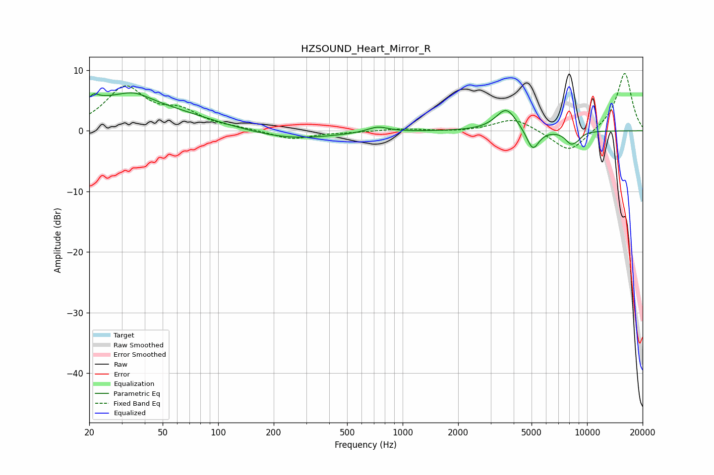

# HZSOUND_Heart_Mirror_R
See [usage instructions](https://github.com/jaakkopasanen/AutoEq#usage) for more options and info.

### Parametric EQs
Apply preamp of -6.4 dB when using parametric equalizer.

|   # | Type    |   Fc (Hz) |    Q |   Gain (dB) |
|-----|---------|-----------|------|-------------|
|   1 | Peaking |        20 | 6    |        -2.7 |
|   2 | Peaking |        21 | 5.7  |         3.4 |
|   3 | Peaking |        27 | 0.36 |         5.1 |
|   4 | Peaking |        35 | 1.74 |         1.3 |
|   5 | Peaking |       245 | 0.6  |        -1.5 |
|   6 | Peaking |       733 | 2.5  |         0.9 |
|   7 | Peaking |      3649 | 2.49 |         3.7 |
|   8 | Peaking |      5076 | 4.07 |        -3.5 |
|   9 | Peaking |      8161 | 4.15 |        -1.8 |
|  10 | Peaking |      8874 | 4.98 |        -0.7 |

### Fixed Band EQs
When using fixed band (also called graphic) equalizer, apply preamp of **-9.6 dB** (if available) and set gains manually with these parameters.

|   # | Type    |   Fc (Hz) |    Q |   Gain (dB) |
|-----|---------|-----------|------|-------------|
|   1 | Peaking |        31 | 1.41 |         6.9 |
|   2 | Peaking |        62 | 1.41 |         2.7 |
|   3 | Peaking |       125 | 1.41 |         0.3 |
|   4 | Peaking |       250 | 1.41 |        -1.4 |
|   5 | Peaking |       500 | 1.41 |        -0.2 |
|   6 | Peaking |      1000 | 1.41 |         0.4 |
|   7 | Peaking |      2000 | 1.41 |        -0.2 |
|   8 | Peaking |      4000 | 1.41 |         2.1 |
|   9 | Peaking |      8000 | 1.41 |        -3.8 |
|  10 | Peaking |     16000 | 1.41 |         9.7 |

### Graphs

