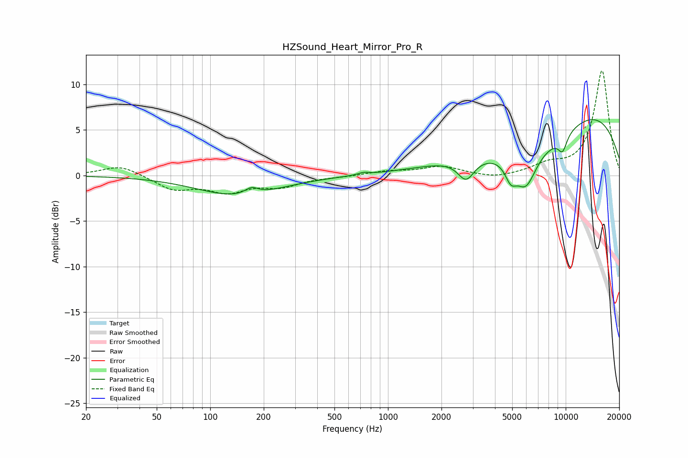

# HZSound_Heart_Mirror_Pro_R
See [usage instructions](https://github.com/jaakkopasanen/AutoEq#usage) for more options and info.

### Parametric EQs
Apply preamp of -6.2 dB when using parametric equalizer.

|   # | Type    |   Fc (Hz) |    Q |   Gain (dB) |
|-----|---------|-----------|------|-------------|
|   1 | Peaking |       144 | 0.61 |        -2.2 |
|   2 | Peaking |       171 | 3.76 |         0.8 |
|   3 | Peaking |       728 | 4.71 |         0.2 |
|   4 | Peaking |      2752 | 3.03 |        -2.3 |
|   5 | Peaking |      4910 | 4.26 |        -1.9 |
|   6 | Peaking |      5961 | 2.33 |        -3.8 |
|   7 | Peaking |      7589 | 0.47 |        -6.2 |
|   8 | Peaking |      9612 | 4.88 |        -2.1 |
|   9 | Peaking |      9675 | 5.13 |         0.4 |
|  10 | Peaking |     10000 | 0.28 |        10.6 |

### Fixed Band EQs
When using fixed band (also called graphic) equalizer, apply preamp of **-11.6 dB** (if available) and set gains manually with these parameters.

|   # | Type    |   Fc (Hz) |    Q |   Gain (dB) |
|-----|---------|-----------|------|-------------|
|   1 | Peaking |        31 | 1.41 |         1.2 |
|   2 | Peaking |        62 | 1.41 |        -1.5 |
|   3 | Peaking |       125 | 1.41 |        -1.6 |
|   4 | Peaking |       250 | 1.41 |        -1.1 |
|   5 | Peaking |       500 | 1.41 |        -0.1 |
|   6 | Peaking |      1000 | 1.41 |         0.4 |
|   7 | Peaking |      2000 | 1.41 |         1   |
|   8 | Peaking |      4000 | 1.41 |        -0.4 |
|   9 | Peaking |      8000 | 1.41 |         1   |
|  10 | Peaking |     16000 | 1.41 |        11.5 |

### Graphs

