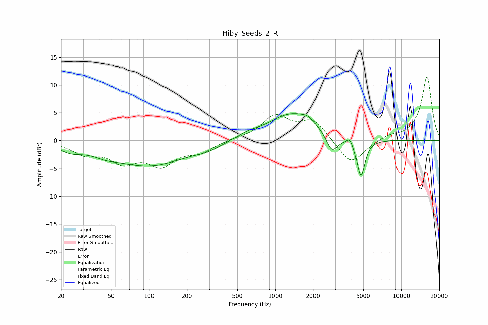

# Hiby_Seeds_2_R
See [usage instructions](https://github.com/jaakkopasanen/AutoEq#usage) for more options and info.

### Parametric EQs
Apply preamp of -4.9 dB when using parametric equalizer.

|   # | Type    |   Fc (Hz) |    Q |   Gain (dB) |
|-----|---------|-----------|------|-------------|
|   1 | Peaking |        24 | 1.66 |        -1.2 |
|   2 | Peaking |        45 | 1.51 |        -0.8 |
|   3 | Peaking |        99 | 0.47 |        -4.4 |
|   4 | Peaking |       292 | 1.39 |        -0.7 |
|   5 | Peaking |       604 | 1.72 |         0.6 |
|   6 | Peaking |      1373 | 0.72 |         4.9 |
|   7 | Peaking |      1831 | 3.06 |         0.7 |
|   8 | Peaking |      2821 | 2.95 |        -3.5 |
|   9 | Peaking |      3940 | 5.98 |         1.1 |
|  10 | Peaking |      4786 | 4.32 |        -6.9 |

### Fixed Band EQs
When using fixed band (also called graphic) equalizer, apply preamp of **-11.6 dB** (if available) and set gains manually with these parameters.

|   # | Type    |   Fc (Hz) |    Q |   Gain (dB) |
|-----|---------|-----------|------|-------------|
|   1 | Peaking |        31 | 1.41 |        -2.1 |
|   2 | Peaking |        62 | 1.41 |        -3.4 |
|   3 | Peaking |       125 | 1.41 |        -3.9 |
|   4 | Peaking |       250 | 1.41 |        -1.8 |
|   5 | Peaking |       500 | 1.41 |         0.2 |
|   6 | Peaking |      1000 | 1.41 |         4.2 |
|   7 | Peaking |      2000 | 1.41 |         3.6 |
|   8 | Peaking |      4000 | 1.41 |        -4.5 |
|   9 | Peaking |      8000 | 1.41 |         0.8 |
|  10 | Peaking |     16000 | 1.41 |        11.6 |

### Graphs

