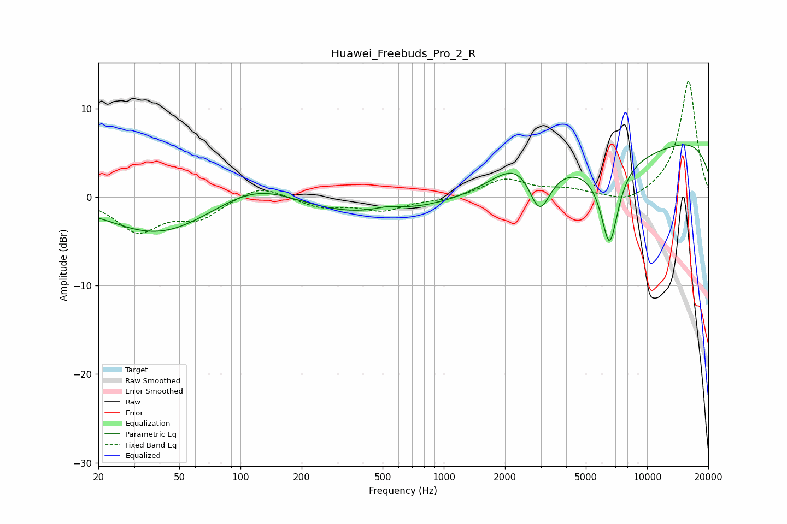

# Huawei_Freebuds_Pro_2_R
See [usage instructions](https://github.com/jaakkopasanen/AutoEq#usage) for more options and info.

### Parametric EQs
Apply preamp of -6.0 dB when using parametric equalizer.

|   # | Type    |   Fc (Hz) |    Q |   Gain (dB) |
|-----|---------|-----------|------|-------------|
|   1 | Peaking |        24 | 5.57 |         0   |
|   2 | Peaking |        38 | 0.6  |        -3   |
|   3 | Peaking |       119 | 0.62 |         4.2 |
|   4 | Peaking |       155 | 0.2  |        -3.1 |
|   5 | Peaking |       531 | 1.99 |         0.5 |
|   6 | Peaking |      2501 | 0.99 |         4.4 |
|   7 | Peaking |      2951 | 2.41 |        -6.3 |
|   8 | Peaking |      4928 | 0.25 |        -4.1 |
|   9 | Peaking |      6536 | 3.07 |        -9.3 |
|  10 | Peaking |     10000 | 0.18 |         8.4 |

### Fixed Band EQs
When using fixed band (also called graphic) equalizer, apply preamp of **-13.2 dB** (if available) and set gains manually with these parameters.

|   # | Type    |   Fc (Hz) |    Q |   Gain (dB) |
|-----|---------|-----------|------|-------------|
|   1 | Peaking |        31 | 1.41 |        -3.7 |
|   2 | Peaking |        62 | 1.41 |        -2.2 |
|   3 | Peaking |       125 | 1.41 |         1.5 |
|   4 | Peaking |       250 | 1.41 |        -1.1 |
|   5 | Peaking |       500 | 1.41 |        -1.4 |
|   6 | Peaking |      1000 | 1.41 |        -0.3 |
|   7 | Peaking |      2000 | 1.41 |         2   |
|   8 | Peaking |      4000 | 1.41 |         0.7 |
|   9 | Peaking |      8000 | 1.41 |        -1   |
|  10 | Peaking |     16000 | 1.41 |        13.2 |

### Graphs

