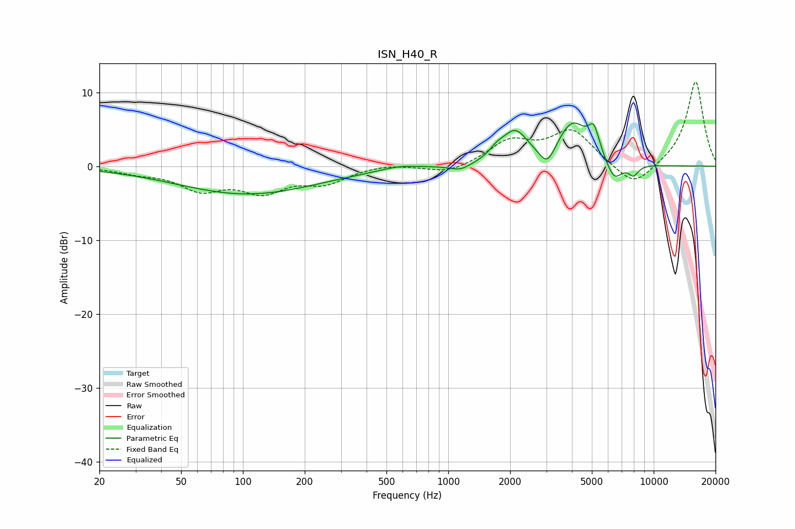

# ISN_H40_R
See [usage instructions](https://github.com/jaakkopasanen/AutoEq#usage) for more options and info.

### Parametric EQs
Apply preamp of -5.9 dB when using parametric equalizer.

|   # | Type    |   Fc (Hz) |    Q |   Gain (dB) |
|-----|---------|-----------|------|-------------|
|   1 | Peaking |       105 | 0.41 |        -3.8 |
|   2 | Peaking |       575 | 1.65 |         0.5 |
|   3 | Peaking |      1146 | 2.75 |        -0.9 |
|   4 | Peaking |      1721 | 3.95 |         0.9 |
|   5 | Peaking |      2111 | 2.21 |         4.3 |
|   6 | Peaking |      3035 | 3.61 |        -2.7 |
|   7 | Peaking |      4025 | 1.84 |         5.7 |
|   8 | Peaking |      5118 | 5.23 |         3.3 |
|   9 | Peaking |      6415 | 3.52 |        -2.8 |
|  10 | Peaking |      7979 | 5.47 |        -1.4 |

### Fixed Band EQs
When using fixed band (also called graphic) equalizer, apply preamp of **-11.5 dB** (if available) and set gains manually with these parameters.

|   # | Type    |   Fc (Hz) |    Q |   Gain (dB) |
|-----|---------|-----------|------|-------------|
|   1 | Peaking |        31 | 1.41 |        -0.7 |
|   2 | Peaking |        62 | 1.41 |        -2.9 |
|   3 | Peaking |       125 | 1.41 |        -3.1 |
|   4 | Peaking |       250 | 1.41 |        -2   |
|   5 | Peaking |       500 | 1.41 |         0.4 |
|   6 | Peaking |      1000 | 1.41 |        -1.1 |
|   7 | Peaking |      2000 | 1.41 |         3.2 |
|   8 | Peaking |      4000 | 1.41 |         4.7 |
|   9 | Peaking |      8000 | 1.41 |        -3.2 |
|  10 | Peaking |     16000 | 1.41 |        11.6 |

### Graphs

