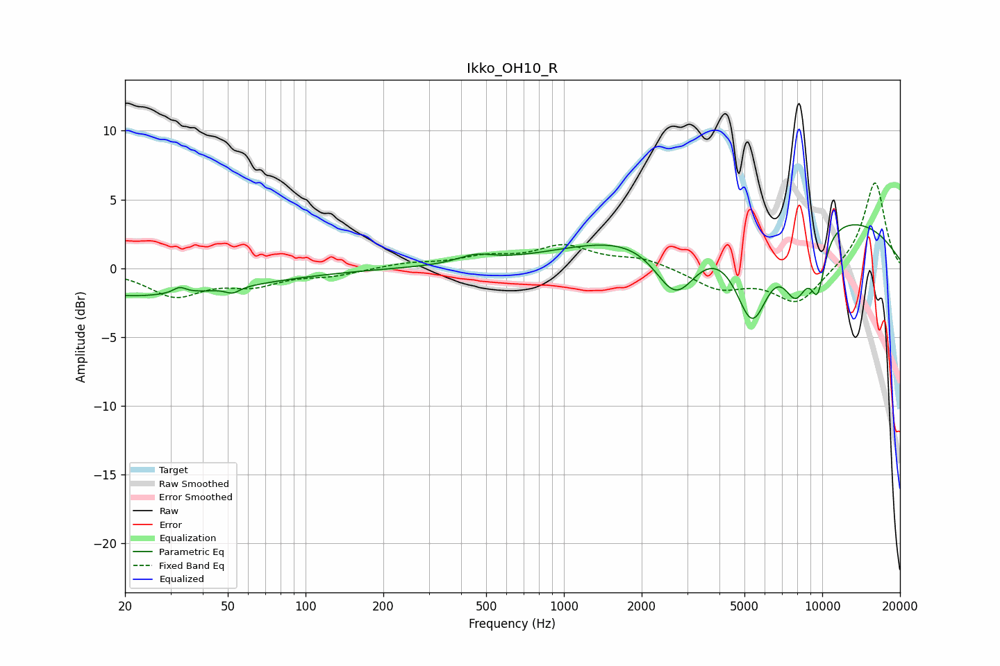

# Ikko_OH10_R
See [usage instructions](https://github.com/jaakkopasanen/AutoEq#usage) for more options and info.

### Parametric EQs
Apply preamp of -3.3 dB when using parametric equalizer.

|   # | Type    |   Fc (Hz) |    Q |   Gain (dB) |
|-----|---------|-----------|------|-------------|
|   1 | Peaking |        20 | 1.15 |        -0.2 |
|   2 | Peaking |        25 | 0.34 |        -1.8 |
|   3 | Peaking |        33 | 5.88 |         0.5 |
|   4 | Peaking |        52 | 5.46 |        -0.4 |
|   5 | Peaking |       453 | 2.07 |         0.6 |
|   6 | Peaking |      2712 | 1.64 |        -4.7 |
|   7 | Peaking |      5355 | 2.02 |        -6.7 |
|   8 | Peaking |      6497 | 0.18 |         4.5 |
|   9 | Peaking |      7913 | 2.56 |        -4.3 |
|  10 | Peaking |      9602 | 4.23 |        -3.8 |

### Fixed Band EQs
When using fixed band (also called graphic) equalizer, apply preamp of **-6.3 dB** (if available) and set gains manually with these parameters.

|   # | Type    |   Fc (Hz) |    Q |   Gain (dB) |
|-----|---------|-----------|------|-------------|
|   1 | Peaking |        31 | 1.41 |        -1.9 |
|   2 | Peaking |        62 | 1.41 |        -1.1 |
|   3 | Peaking |       125 | 1.41 |        -0.5 |
|   4 | Peaking |       250 | 1.41 |         0.3 |
|   5 | Peaking |       500 | 1.41 |         0.7 |
|   6 | Peaking |      1000 | 1.41 |         1.5 |
|   7 | Peaking |      2000 | 1.41 |         0.7 |
|   8 | Peaking |      4000 | 1.41 |        -1.4 |
|   9 | Peaking |      8000 | 1.41 |        -2.6 |
|  10 | Peaking |     16000 | 1.41 |         6.4 |

### Graphs

