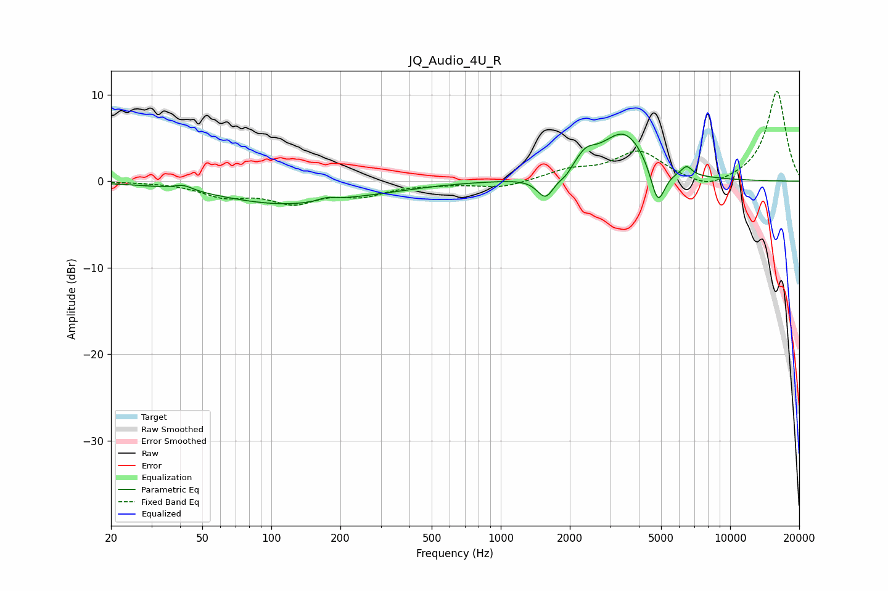

# JQ_Audio_4U_R
See [usage instructions](https://github.com/jaakkopasanen/AutoEq#usage) for more options and info.

### Parametric EQs
Apply preamp of -5.5 dB when using parametric equalizer.

|   # | Type    |   Fc (Hz) |    Q |   Gain (dB) |
|-----|---------|-----------|------|-------------|
|   1 | Peaking |        41 | 3.62 |         0.6 |
|   2 | Peaking |       116 | 0.48 |        -2.6 |
|   3 | Peaking |       175 | 3.53 |         0.4 |
|   4 | Peaking |       336 | 0.9  |        -0.2 |
|   5 | Peaking |      1570 | 3.79 |        -2.6 |
|   6 | Peaking |      1916 | 5.25 |        -0.6 |
|   7 | Peaking |      2340 | 3.18 |         1.7 |
|   8 | Peaking |      3452 | 1.35 |         5.7 |
|   9 | Peaking |      4839 | 4.27 |        -4.9 |
|  10 | Peaking |      6466 | 6    |         1.1 |

### Fixed Band EQs
When using fixed band (also called graphic) equalizer, apply preamp of **-10.5 dB** (if available) and set gains manually with these parameters.

|   # | Type    |   Fc (Hz) |    Q |   Gain (dB) |
|-----|---------|-----------|------|-------------|
|   1 | Peaking |        31 | 1.41 |        -0   |
|   2 | Peaking |        62 | 1.41 |        -1.6 |
|   3 | Peaking |       125 | 1.41 |        -2.2 |
|   4 | Peaking |       250 | 1.41 |        -1.4 |
|   5 | Peaking |       500 | 1.41 |        -0.2 |
|   6 | Peaking |      1000 | 1.41 |        -0.8 |
|   7 | Peaking |      2000 | 1.41 |         1.1 |
|   8 | Peaking |      4000 | 1.41 |         3.4 |
|   9 | Peaking |      8000 | 1.41 |        -1.2 |
|  10 | Peaking |     16000 | 1.41 |        10.5 |

### Graphs

