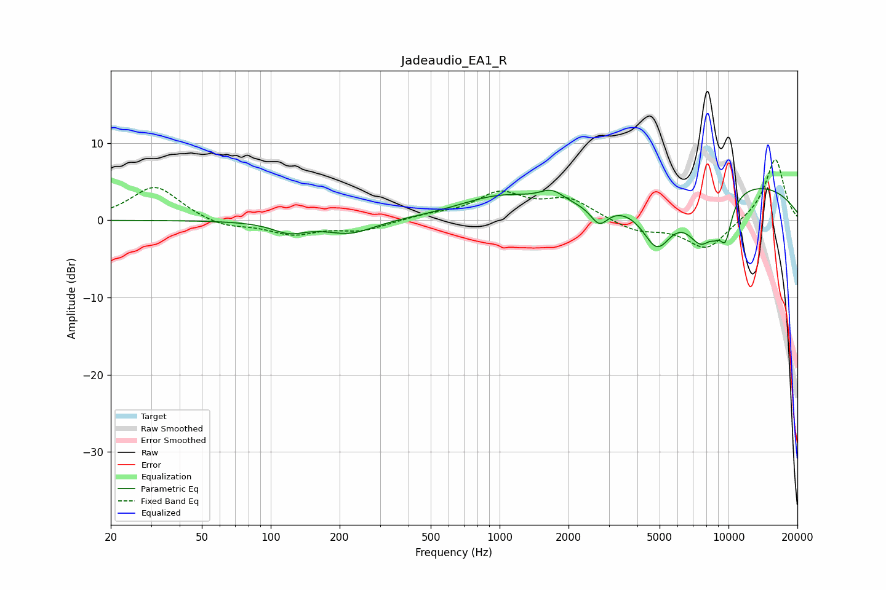

# Jadeaudio_EA1_R
See [usage instructions](https://github.com/jaakkopasanen/AutoEq#usage) for more options and info.

### Parametric EQs
Apply preamp of -4.2 dB when using parametric equalizer.

|   # | Type    |   Fc (Hz) |    Q |   Gain (dB) |
|-----|---------|-----------|------|-------------|
|   1 | Peaking |       120 | 1.9  |        -1.4 |
|   2 | Peaking |       222 | 1.32 |        -1.7 |
|   3 | Peaking |      1004 | 0.76 |         2.8 |
|   4 | Peaking |      1690 | 2.7  |         1.5 |
|   5 | Peaking |      2728 | 3.63 |        -2.5 |
|   6 | Peaking |      4874 | 2.04 |        -6.3 |
|   7 | Peaking |      7626 | 1.95 |        -6.3 |
|   8 | Peaking |      8725 | 5.89 |        -1   |
|   9 | Peaking |      9689 | 4.34 |        -4.8 |
|  10 | Peaking |     10000 | 0.26 |         5.2 |

### Fixed Band EQs
When using fixed band (also called graphic) equalizer, apply preamp of **-8.0 dB** (if available) and set gains manually with these parameters.

|   # | Type    |   Fc (Hz) |    Q |   Gain (dB) |
|-----|---------|-----------|------|-------------|
|   1 | Peaking |        31 | 1.41 |         4.5 |
|   2 | Peaking |        62 | 1.41 |        -1   |
|   3 | Peaking |       125 | 1.41 |        -1.7 |
|   4 | Peaking |       250 | 1.41 |        -1.3 |
|   5 | Peaking |       500 | 1.41 |         0.6 |
|   6 | Peaking |      1000 | 1.41 |         3.3 |
|   7 | Peaking |      2000 | 1.41 |         2.6 |
|   8 | Peaking |      4000 | 1.41 |        -1.4 |
|   9 | Peaking |      8000 | 1.41 |        -3.8 |
|  10 | Peaking |     16000 | 1.41 |         8.1 |

### Graphs

