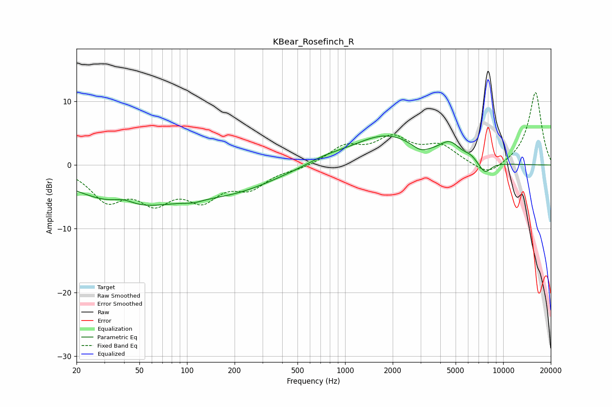

# KBear_Rosefinch_R
See [usage instructions](https://github.com/jaakkopasanen/AutoEq#usage) for more options and info.

### Parametric EQs
Apply preamp of -4.7 dB when using parametric equalizer.

|   # | Type    |   Fc (Hz) |    Q |   Gain (dB) |
|-----|---------|-----------|------|-------------|
|   1 | Peaking |        40 | 2.1  |         1   |
|   2 | Peaking |        43 | 0.42 |        -6   |
|   3 | Peaking |       109 | 2.4  |        -0.4 |
|   4 | Peaking |       201 | 0.5  |        -3.3 |
|   5 | Peaking |       744 | 1.13 |         0.8 |
|   6 | Peaking |      1827 | 0.65 |         4.7 |
|   7 | Peaking |      2998 | 2.55 |        -1.1 |
|   8 | Peaking |      4602 | 2.2  |         2.3 |
|   9 | Peaking |      6230 | 3.53 |         0.6 |
|  10 | Peaking |      7651 | 3.31 |        -1.9 |

### Fixed Band EQs
When using fixed band (also called graphic) equalizer, apply preamp of **-11.5 dB** (if available) and set gains manually with these parameters.

|   # | Type    |   Fc (Hz) |    Q |   Gain (dB) |
|-----|---------|-----------|------|-------------|
|   1 | Peaking |        31 | 1.41 |        -5   |
|   2 | Peaking |        62 | 1.41 |        -4.9 |
|   3 | Peaking |       125 | 1.41 |        -4.6 |
|   4 | Peaking |       250 | 1.41 |        -3.1 |
|   5 | Peaking |       500 | 1.41 |        -0.5 |
|   6 | Peaking |      1000 | 1.41 |         2.7 |
|   7 | Peaking |      2000 | 1.41 |         3.9 |
|   8 | Peaking |      4000 | 1.41 |         2.7 |
|   9 | Peaking |      8000 | 1.41 |        -2   |
|  10 | Peaking |     16000 | 1.41 |        11.5 |

### Graphs

