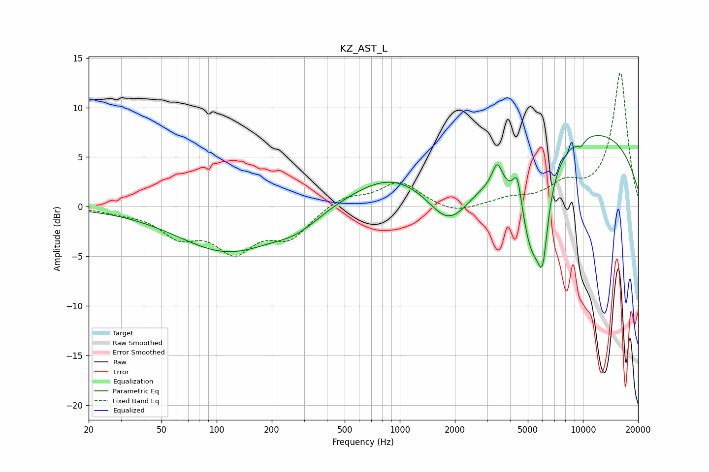

# KZ_AST_L
See [usage instructions](https://github.com/jaakkopasanen/AutoEq#usage) for more options and info.

### Parametric EQs
Apply preamp of -7.3 dB when using parametric equalizer.

|   # | Type    |   Fc (Hz) |    Q |   Gain (dB) |
|-----|---------|-----------|------|-------------|
|   1 | Peaking |       115 | 0.51 |        -4.5 |
|   2 | Peaking |       276 | 1.22 |        -1.2 |
|   3 | Peaking |       907 | 0.62 |         3.2 |
|   4 | Peaking |      1857 | 1.19 |        -4.4 |
|   5 | Peaking |      3403 | 5.21 |         2.4 |
|   6 | Peaking |      4385 | 5.99 |         3.2 |
|   7 | Peaking |      5257 | 1.99 |        -9.4 |
|   8 | Peaking |      6022 | 4.94 |        -6.2 |
|   9 | Peaking |      9753 | 5.61 |        -0.7 |
|  10 | Peaking |     10000 | 0.25 |         7.9 |

### Fixed Band EQs
When using fixed band (also called graphic) equalizer, apply preamp of **-13.6 dB** (if available) and set gains manually with these parameters.

|   # | Type    |   Fc (Hz) |    Q |   Gain (dB) |
|-----|---------|-----------|------|-------------|
|   1 | Peaking |        31 | 1.41 |        -0.4 |
|   2 | Peaking |        62 | 1.41 |        -2.6 |
|   3 | Peaking |       125 | 1.41 |        -4   |
|   4 | Peaking |       250 | 1.41 |        -2.8 |
|   5 | Peaking |       500 | 1.41 |         1.1 |
|   6 | Peaking |      1000 | 1.41 |         2.5 |
|   7 | Peaking |      2000 | 1.41 |        -0.8 |
|   8 | Peaking |      4000 | 1.41 |         0.7 |
|   9 | Peaking |      8000 | 1.41 |         1.9 |
|  10 | Peaking |     16000 | 1.41 |        13.5 |

### Graphs

