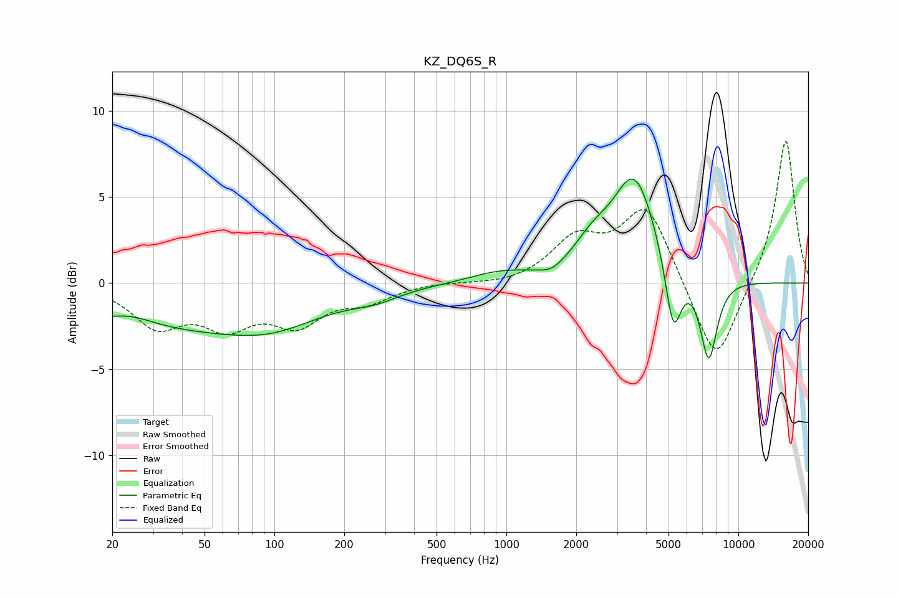

# KZ_DQ6S_R
See [usage instructions](https://github.com/jaakkopasanen/AutoEq#usage) for more options and info.

### Parametric EQs
Apply preamp of -6.1 dB when using parametric equalizer.

|   # | Type    |   Fc (Hz) |    Q |   Gain (dB) |
|-----|---------|-----------|------|-------------|
|   1 | Peaking |        24 | 1.33 |         0.7 |
|   2 | Peaking |        35 | 0.23 |        -2.6 |
|   3 | Peaking |        98 | 0.73 |        -0.9 |
|   4 | Peaking |       271 | 1.39 |        -0.5 |
|   5 | Peaking |       929 | 1.09 |         0.6 |
|   6 | Peaking |      1570 | 2.78 |        -0.4 |
|   7 | Peaking |      2348 | 1.77 |         1.4 |
|   8 | Peaking |      3568 | 1.47 |         6   |
|   9 | Peaking |      5238 | 3.95 |        -4.2 |
|  10 | Peaking |      7451 | 3.63 |        -4.8 |

### Fixed Band EQs
When using fixed band (also called graphic) equalizer, apply preamp of **-8.3 dB** (if available) and set gains manually with these parameters.

|   # | Type    |   Fc (Hz) |    Q |   Gain (dB) |
|-----|---------|-----------|------|-------------|
|   1 | Peaking |        31 | 1.41 |        -2.3 |
|   2 | Peaking |        62 | 1.41 |        -2.1 |
|   3 | Peaking |       125 | 1.41 |        -2.1 |
|   4 | Peaking |       250 | 1.41 |        -0.9 |
|   5 | Peaking |       500 | 1.41 |         0.1 |
|   6 | Peaking |      1000 | 1.41 |        -0.2 |
|   7 | Peaking |      2000 | 1.41 |         2.4 |
|   8 | Peaking |      4000 | 1.41 |         4.5 |
|   9 | Peaking |      8000 | 1.41 |        -5   |
|  10 | Peaking |     16000 | 1.41 |         8.5 |

### Graphs

