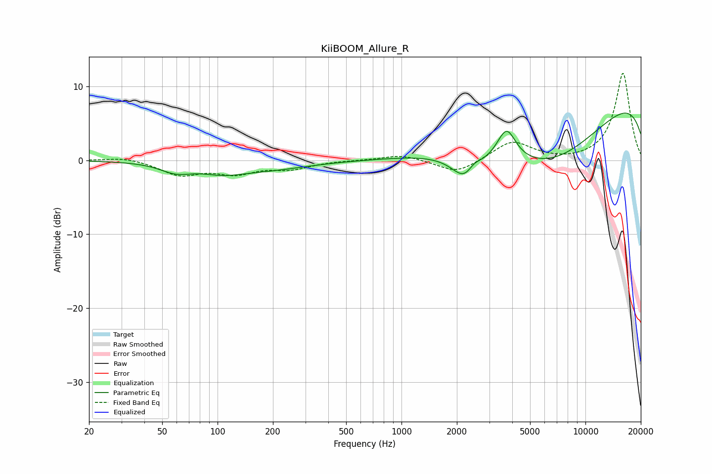

# KiiBOOM_Allure_R
See [usage instructions](https://github.com/jaakkopasanen/AutoEq#usage) for more options and info.

### Parametric EQs
Apply preamp of -6.5 dB when using parametric equalizer.

|   # | Type    |   Fc (Hz) |    Q |   Gain (dB) |
|-----|---------|-----------|------|-------------|
|   1 | Peaking |        59 | 1.66 |        -1.3 |
|   2 | Peaking |       106 | 1.24 |        -1   |
|   3 | Peaking |       181 | 0.61 |        -1.2 |
|   4 | Peaking |       623 | 3.1  |        -0   |
|   5 | Peaking |       883 | 3.47 |        -0   |
|   6 | Peaking |      2244 | 1.96 |        -3.7 |
|   7 | Peaking |      2469 | 3.76 |         1.3 |
|   8 | Peaking |      3726 | 2.82 |         4.3 |
|   9 | Peaking |      6382 | 0.38 |       -10.4 |
|  10 | Peaking |     10000 | 0.18 |        11.1 |

### Fixed Band EQs
When using fixed band (also called graphic) equalizer, apply preamp of **-11.9 dB** (if available) and set gains manually with these parameters.

|   # | Type    |   Fc (Hz) |    Q |   Gain (dB) |
|-----|---------|-----------|------|-------------|
|   1 | Peaking |        31 | 1.41 |         0.5 |
|   2 | Peaking |        62 | 1.41 |        -1.9 |
|   3 | Peaking |       125 | 1.41 |        -1.6 |
|   4 | Peaking |       250 | 1.41 |        -1   |
|   5 | Peaking |       500 | 1.41 |         0   |
|   6 | Peaking |      1000 | 1.41 |         0.8 |
|   7 | Peaking |      2000 | 1.41 |        -1.8 |
|   8 | Peaking |      4000 | 1.41 |         2.6 |
|   9 | Peaking |      8000 | 1.41 |        -0.2 |
|  10 | Peaking |     16000 | 1.41 |        11.8 |

### Graphs

