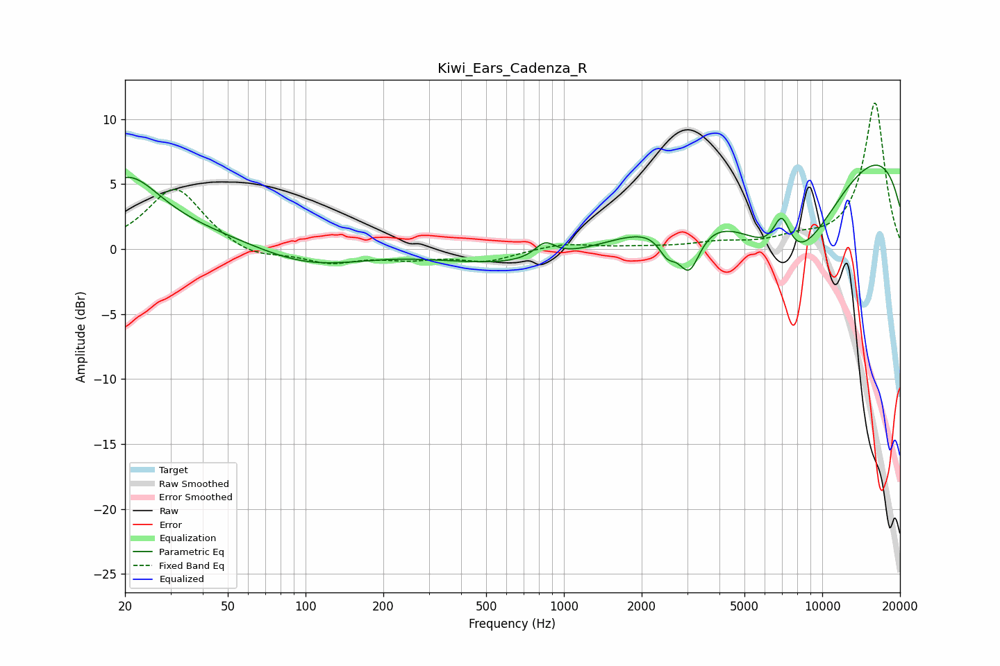

# Kiwi_Ears_Cadenza_R
See [usage instructions](https://github.com/jaakkopasanen/AutoEq#usage) for more options and info.

### Parametric EQs
Apply preamp of -6.6 dB when using parametric equalizer.

|   # | Type    |   Fc (Hz) |    Q |   Gain (dB) |
|-----|---------|-----------|------|-------------|
|   1 | Peaking |        20 | 1.09 |         5   |
|   2 | Peaking |        98 | 0.52 |        -4   |
|   3 | Peaking |       107 | 0.3  |         4   |
|   4 | Peaking |       606 | 0.19 |        -2.5 |
|   5 | Peaking |       845 | 3.52 |         1.2 |
|   6 | Peaking |      2514 | 4.03 |        -1.7 |
|   7 | Peaking |      3054 | 3.24 |        -3.6 |
|   8 | Peaking |      6973 | 3.84 |         3.1 |
|   9 | Peaking |      7589 | 0.62 |       -10.6 |
|  10 | Peaking |      9647 | 0.18 |        10.5 |

### Fixed Band EQs
When using fixed band (also called graphic) equalizer, apply preamp of **-11.3 dB** (if available) and set gains manually with these parameters.

|   # | Type    |   Fc (Hz) |    Q |   Gain (dB) |
|-----|---------|-----------|------|-------------|
|   1 | Peaking |        31 | 1.41 |         4.8 |
|   2 | Peaking |        62 | 1.41 |        -0.8 |
|   3 | Peaking |       125 | 1.41 |        -1   |
|   4 | Peaking |       250 | 1.41 |        -0.6 |
|   5 | Peaking |       500 | 1.41 |        -0.9 |
|   6 | Peaking |      1000 | 1.41 |         0.5 |
|   7 | Peaking |      2000 | 1.41 |         0.1 |
|   8 | Peaking |      4000 | 1.41 |         0.4 |
|   9 | Peaking |      8000 | 1.41 |         0.6 |
|  10 | Peaking |     16000 | 1.41 |        11.3 |

### Graphs

